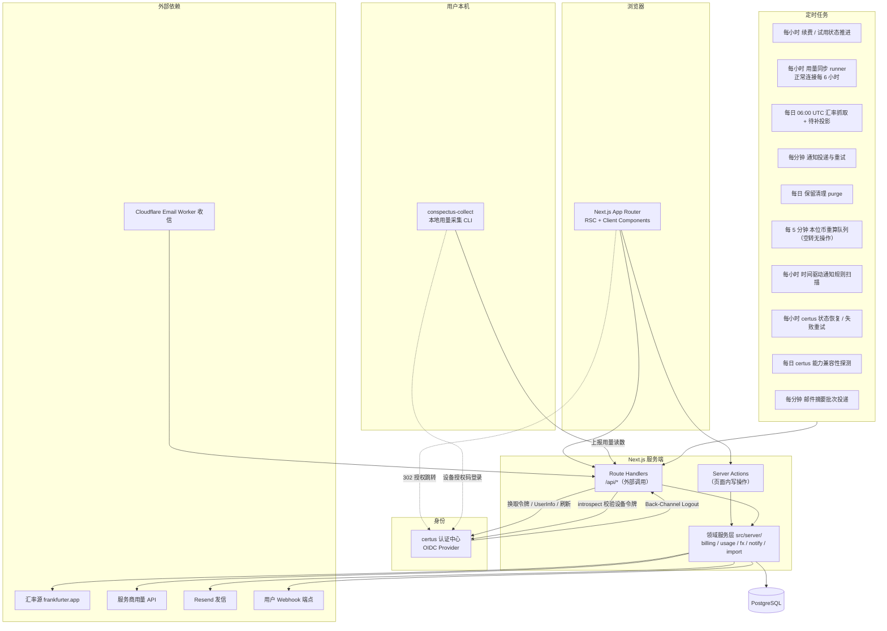
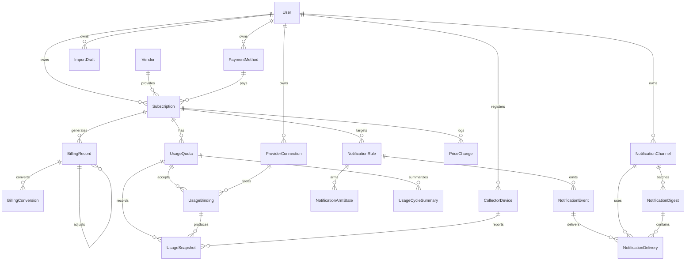
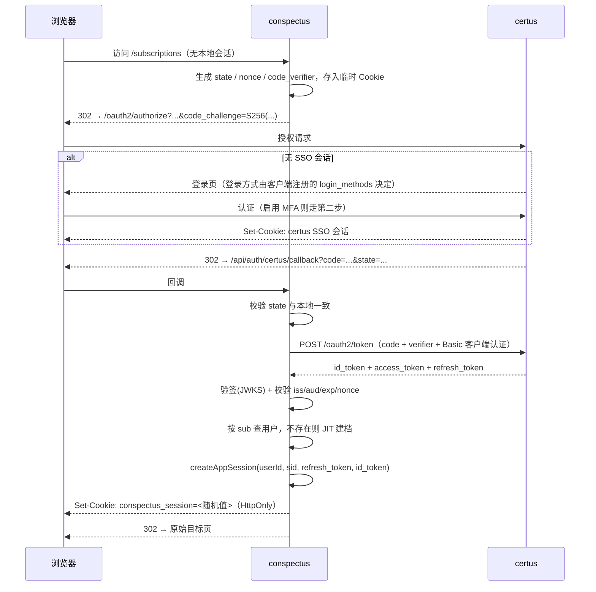
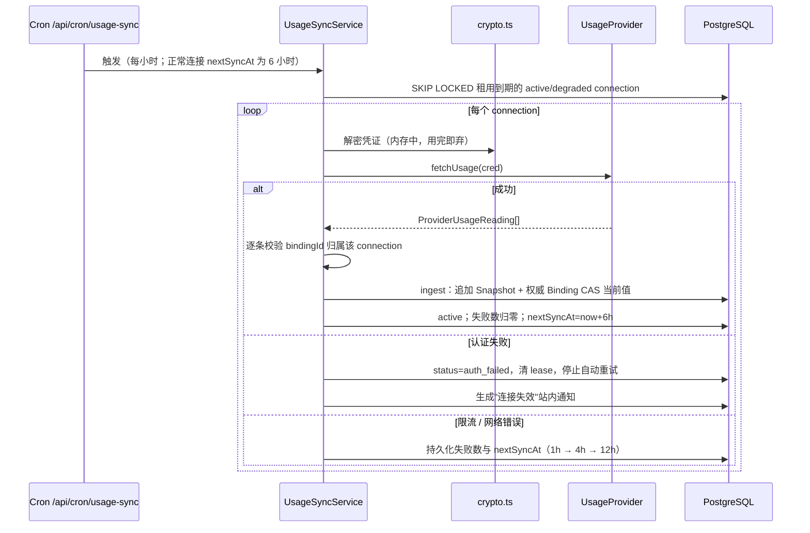
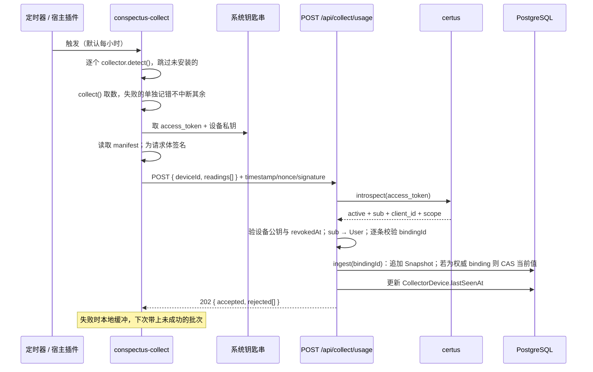
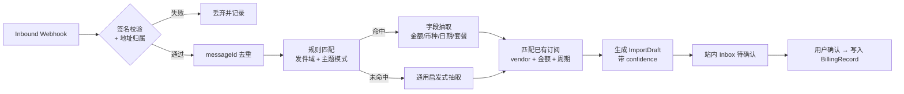

# conspectus 设计文档

> 订阅资产管理中心 · v0.6.0 · 2026-08-08 · **M0–M6 全部交付**；本版与实现对齐（补 10 条端点、3 张表、2 个安全修复字段、collector 环境变量；certus#9 已就绪）。审阅记录见 [design-review.md](./design-review.md)

---

## 1. 产品定位

conspectus（拉丁语"一览、总览"）是一个**订阅资产管理中心**：把散落在各处的付费订阅——流媒体、云服务、域名、SaaS 工具、AI coding plan——收拢成一张可以一眼扫完的清单，回答四个问题：

1. **我在订阅什么？** 完整清单、分类、状态。
2. **我花了多少钱？** 按月/年折算、多币种统一口径、趋势。
3. **什么时候要付钱？** 续费日历、试用到期、涨价预警。
4. **我用够本了吗？** 对有用量额度的订阅（AI coding plan、API 套餐、云资源包），追踪"已用 / 额度"，识别浪费和临期不足。

第 4 点是 conspectus 区别于普通记账类订阅管理工具的核心差异。

**产品家族**：specus / certus / scriptus / conspectus 共用 `#14161F` 深灰骨架，conspectus 强调色为砖红 `#C4553C`（明色底）/ `#E07A5F`（暗色底）。

其中 **certus 是家族的统一认证中心**，conspectus 可作为它的接入系统（OIDC 客户端）实现单点登录，也支持独立部署时使用本地账号 —— 详见 [§7.1](#71-认证与身份)。

---

## 2. 目标与非目标

### 2.1 V1 目标

| 编号 | 目标 | 阶段 |
| --- | --- | --- |
| G1 | 多用户，登录支持 [certus 认证中心](../../certus/docs/auth-center-guide.md)（OIDC 单点登录）与本地账号两种模式、按需开启，数据严格按用户隔离 | M1（certus）/ M1b（local） |
| G2 | 订阅的完整生命周期管理（录入、试用、续费、暂停、取消、涨价） | M1–M2 |
| G3 | 多币种记账 + 汇率换算到本位币，统计口径稳定 | M2 |
| G4 | 用量额度追踪：服务端适配器 + 本地 CLI 采集器 + 手动录入三通道 | M3–M4 |
| G5 | 到期 / 试用结束 / 用量超阈值的主动通知（邮件 + Webhook） | M3 |
| G6 | 邮件账单自动导入（解析为草稿，用户确认后入库） | M6 |
| G7 | CSV 导入导出，数据可迁移、可备份 | M2 |
| G8 | 花费统计与可视化（月度趋势、分类占比、年化成本） | M2 |
| G9 | 可安装为 PWA，移动端可用 | M5 |
| G10 | 同一套代码既能部署到自有服务器（Docker），也能托管到 Vercel | M5 |

### 2.2 非目标（明确不做）

- ❌ **不做支付网关**：conspectus 只记录订阅，不代扣、不代付、不碰银行卡号。
- ❌ **不做自动退订**：不模拟登录第三方站点执行取消操作，只提供取消入口链接和提醒。
- ❌ **不做团队协作 / 分摊结算**（V2 考虑 workspace 模型）。
- ❌ **不做企业级采购审批流**。
- ❌ **不存储任何完整支付凭证**（卡号、CVV），只存用户自填的标签和后四位。
- ❌ **不在本地账号模式里做 MFA**：需要 MFA 就用 certus 模式，它已有 TOTP、恢复码与 AAL 分级。
- ❌ **不做账号自动合并**：同一邮箱的本地账号与 certus 账号不会被自动认作同一人，只能由已登录用户主动绑定。

---

## 3. 核心概念

| 概念 | 说明 |
| --- | --- |
| **certus** | 统一认证中心。`certus` 模式下的权威身份源：持有账号、密码、MFA，签发 ID Token。 |
| **`sub`** | certus 下发的用户唯一标识，**永不复用、永不变更**。certus 身份的关联一律以它为准，**不用 email**。 |
| **User（用户）** | conspectus 的用户主档：业务属性（本位币、时区、收件地址）+ 身份关联（certus `sub` 和/或本地密码哈希，见 §7.1）。 |
| **Vendor（服务商）** | 提供订阅的主体，如 Netflix、Anthropic、阿里云。内置目录 + 用户自建。 |
| **Subscription（订阅）** | 用户与某个 Vendor 的一份付费关系，是系统的核心实体。带价格、周期、状态。 |
| **BillingRecord（账单记录）** | 一次扣费、退款或系统生成的待确认续费事件；原币事实不可变，用于还原净支出。 |
| **BillingCycle（计费周期）** | weekly / monthly / quarterly / yearly / custom(N 天) / lifetime / `one_time`。 |
| **UsageQuota（用量额度）** | 订阅附带的可量化配额，如"每月 500 次请求"。一个订阅可有多个 metric。 |
| **UsageBinding（用量绑定）** | 服务端签发的不透明写入目标，把 provider/collector 的一个 metric 精确绑定到用户的一张 UsageQuota。 |
| **UsageSnapshot（用量快照）** | 某时刻的用量读数，用于画消耗曲线、预测是否会超额。 |
| **ProviderConnection（服务商连接）** | 用户授权的凭证（API Key / OAuth token），用于自动拉取用量。加密存储。 |
| **CollectorDevice（采集设备）** | 装了本地采集 CLI 的一台机器。用量只在本机可见的订阅，靠它上报。 |
| **NotificationRule（通知规则）** | 触发条件（type + config）；V1 不绑定渠道，命中后向全部启用渠道投递。 |
| **certus 关联状态** | 与全局 `User.status` 分离：consent 404 只表示该 SSO 关联需要重新授权，不能借此锁死 `both` 模式下仍有效的本地登录。 |
| **ImportDraft（导入草稿）** | 邮件或 CSV 解析出的候选记录，**未经用户确认不进入正式数据**。 |
| **BaseCurrency（本位币）** | 用户设定的统计口径币种，所有金额折算到它再汇总。 |

---

## 4. 关键用户场景

1. **录入**：用户新建订阅"Claude Max 年付 ¥1,440"，选择周期"每年"、首次扣费日"2026-03-12"，系统自动算出下次续费 `2027-03-12`，并折算成月均成本 ¥120。
2. **总览**：首页看到"本月支出 ¥862 / 年化 ¥10,344 / 未来 7 天有 3 笔续费"，以及一张按分类的占比图。
3. **用量**：用户在自己常用的开发机上装了 `conspectus-collect` 并用 certus 授权，它每小时读一次本机 coding plan 的用量并上报；网页卡片显示"本周期已用 68%，按当前速度约在周期结束前 2 天用完"。
4. **提醒**：域名年费到期前 14 天，用户收到邮件；同时 Webhook 推送到自建的 Bark/飞书机器人。
5. **导入**：用户把扣款邮件转发到专属地址，系统解析出"Vendor: Spotify / ¥15 / 2026-08-05"，生成草稿并在站内待确认列表中提示，用户点"匹配到已有订阅"完成归档。
6. **止损**：用户在"闲置"视图里看到某订阅连续 3 个周期用量不足 10%，点开取消链接直接去官网退订。

---

## 5. 技术架构

### 5.1 技术栈

| 层 | 选型 | 说明 |
| --- | --- | --- |
| 框架 | Next.js 16（App Router） | 前后端同仓，Server Components + Server Actions |
| UI | React 19 + Tailwind CSS v4 | 沿用脚手架 |
| 语言 | TypeScript 5（`strict: true`） | |
| ORM | Prisma | 迁移管理成熟，类型安全 |
| 数据库 | PostgreSQL 16 | 托管选 Neon / Supabase；本地 Docker |
| 认证 | **certus 认证中心** + 本地账号，`AUTH_MODE` 按需开启 | 见 §7.1；两种模式共用同一套会话 |
| OIDC 客户端 | `openid-client` | 负责 discovery、授权码 + PKCE、state / nonce 与令牌校验；不承担应用会话 |
| 应用会话 | 自有不透明会话 + PostgreSQL | certus 与本地密码验证后统一签发同一种数据库会话，支持按 `sid` / `sub` 撤销 |
| PWA | Manifest + Service Worker | 可安装；V1 只缓存静态应用壳，不缓存用户财务数据，见 §7.9 |
| 部署 | Docker / compose（自有服务器）+ Vercel | 环境差异收敛到定时任务触发方与数据库位置，见 §5.4 |
| 校验 | Zod | Server Action 入参、外部数据、CSV 行统一校验 |
| 定时任务 | Vercel Cron（托管）/ cron 容器 curl（自部署） | 统一走 `/api/cron/*` 端点 + 密钥校验，见 §5.4 |
| 邮件发送 | Resend | 通知邮件、验证邮件 |
| 邮件接收 | Cloudflare Email Worker → Webhook | 专属转发地址方案 |
| 图表 | Recharts | |
| 测试 | Vitest + Playwright | 单测跑纯函数（周期计算、汇率），E2E 跑关键流程 |

> **为什么后端不独立拆分**：V1 的后端逻辑几乎全是 CRUD + 定时任务，拆成独立服务会带来跨服务鉴权、部署、类型同步三份额外成本，收益为负。定时任务与解析逻辑集中在 `src/server/` 目录内，保持模块边界清晰，将来要拆随时可拆。

### 5.2 系统架构



### 5.3 目录结构

仓库**锁定 `src/` 布局**（Next.js 也支持根级 `app/`，本项目统一放 `src/` 下，M1 初始化按此执行）。`design/logo/` 是设计暂存区：`AppLogo.tsx` 在 M1 迁入 `src/components/`，`README-snippet.md` 已消化进 README。

```
conspectus/
├─ docs/                      # 设计文档、资产
│  ├─ design.md
│  └─ assets/                 # logo-light.svg / logo-dark.svg / logo-mark*.svg
├─ prisma/
│  ├─ schema.prisma
│  ├─ migrations/
│  └─ seed.ts                 # 内置 Vendor 目录、货币表
├─ public/                    # logo.svg / favicon*.svg / PWA 图标 / manifest.webmanifest
├─ docker/                    # Dockerfile、compose、cron 容器
├─ scripts/admin-create-user.ts # local-only 首账号交互创建脚本
├─ vercel.json                # Vercel Cron 声明
├─ collector/                 # 本地采集 CLI，独立 npm 包，不进 Next.js 构建
│  └─ src/
│     ├─ types.ts             # 与服务端共享的 UsageReading 契约
│     ├─ auth.ts              # certus 设备授权码 + 系统钥匙串
│     ├─ report.ts            # 上报、本地缓冲与重试
│     └─ collectors/          # 每个被采集工具一个实现
└─ src/
   ├─ app/
   │  ├─ login/               # 登录页；本地模式下另有注册/找回密码（register/、reset-password/，按 AUTH_MODE 条件注册）
   │  ├─ (app)/               # 需登录
   │  │  ├─ page.tsx          # 总览 Dashboard
   │  │  ├─ subscriptions/    # 列表、详情、编辑
   │  │  ├─ calendar/         # 续费日历
   │  │  ├─ usage/            # 用量中心
   │  │  ├─ analytics/        # 花费统计
   │  │  ├─ inbox/            # 导入草稿待确认
   │  │  └─ settings/         # 本位币、通知、连接、导入导出
   │  └─ api/
   │     ├─ auth/certus/{start,callback,logout}/ # OIDC 发起、回调、RP-Initiated Logout
   │     ├─ auth/{local-login,local-register,password-reset,verify-email,request-verification,logout}/ # 本地认证（按 AUTH_MODE 条件注册）
   │     ├─ auth/bind/{,start}/           # 绑定 certus：start 发起授权，回调按事务 purpose 分派
   │     ├─ auth/reauth/start/            # 敏感操作重新认证
   │     ├─ auth/delete-account/          # 注销账号
   │     ├─ auth/backchannel-logout/      # 接收 certus 的 logout_token
   │     ├─ billing/{stats,calendar}/     # 总览与日历数据
   │     ├─ settings/devices/             # 采集设备管理
   │     ├─ cron/{renewals,usage-sync,fx,notification-scan,notification-dispatch,notification-digest,identity-status,certus-capabilities,purge,rebase}/
   │     ├─ collect/{devices,usage,manifest}/ # 设备公钥注册、用量上报、绑定清单
   │     ├─ {health,ready}/       # 存活 / 就绪探针
   │     ├─ inbound/email/    # 邮件 webhook 入口
   │     └─ export/           # CSV 导出流
   ├─ components/             # 导航、订阅表单、图表等客户端组件
   └─ server/                 # 领域逻辑，不依赖 React
      ├─ auth/                # certus RP 配置、JIT 建档、会话与登出、凭证加解密（crypto.ts）
      ├─ billing/             # 周期推算、年化折算、汇率抓取与换算（fx.ts）
      ├─ usage/
      │  ├─ sync.ts           # Provider 注册表与同步调度
      │  ├─ ingest.ts         # 通道 A/B/C 共用的入库、去重与周期重置
      │  └─ providers/        # 每个服务商一个适配器
      ├─ notify/              # 规则求值、渠道分发、去重
      ├─ import/              # 邮件解析规则、CSV 解析
      └─ db.ts                # Prisma client 单例
```

### 5.4 部署形态

同一份代码要能落在两种环境上。做法是**把环境差异全部收敛到"谁来触发定时任务"和"数据库在哪"两点**，业务代码不出现任何 `if (vercel)` 分支。

| 关注点 | 自有服务器（主目标） | Vercel 托管 |
| --- | --- | --- |
| 运行方式 | Docker 镜像 + `docker compose`，Next.js standalone 输出 | Vercel 构建，函数运行 |
| 数据库 | 同 compose 起的 PostgreSQL，或外部实例 | Neon / Supabase 等托管 Postgres |
| 定时任务 | compose 内的 `cron` 容器（或 systemd timer）按表 curl `/api/cron/*` | Vercel Cron 发 GET；完整的分钟级通知投递要求 Pro，Hobby 需外部调度器或接受每日降级 |
| 长任务 | 无硬性时长上限，可跑全量同步 | **有函数执行时长上限**，必须分片（见 R4） |
| 邮件接收 | Cloudflare Email Worker → 本站 webhook | 同左，无差异 |
| 文件/状态 | 无本地磁盘依赖（导出走流式响应，不落盘） | 同左 —— 正因如此才能两边跑 |
| TLS | 反向代理（Caddy/Nginx）终止 | 平台自带 |

**定时任务的统一契约**：所有周期性工作都暴露为 `GET /api/cron/<job>` + `Authorization: Bearer $CRON_SECRET`。使用 GET 是为了匹配 Vercel Cron 的固定调用方式；端点统一返回 `Cache-Control: no-store`，不接受 Cookie 鉴权，任务逻辑本身不知道触发方。自有服务器同样用 curl GET，因此两种形态共用代码、锁和幂等保证。

任务可能重复投递或并发重叠。每个任务都必须同时具备：数据库租约锁（防同一分片并发）、业务唯一键（防锁失效或平台重复投递）和可重入游标。不能把 `$CRON_SECRET` 或“平台通常只调一次”当成幂等保证。

**保留清理任务**（`/api/cron/purge`，每日）：兑现全文各项 TTL 承诺 —— 过期 `Session` 与 `PasswordResetToken`；过期或已消费的 `ReauthTransaction`；超过各自 `expiresAt` 的 `BackchannelLogoutReplay`；`UsageSnapshot` 超过 180 天的行、超过 30 天的 `raw`（置空不删行；仍被 `UsageQuota.valueSnapshotId` 引用的当前行保留到被新快照替换）；超过 10 分钟保留期（5 分钟时间窗 + 时钟/调度余量）的 `CollectorNonce`；终态超过 90 天的 `NotificationDelivery` 与 `NotificationDigest`；过期 `ImportDraft`（置 `expired`）；到达 `rawRetainedUntil` 的 `InboundEmail.rawCipher`。逐项幂等、分批处理，不误删未到期行；从 M1 起随各模块上线逐步纳入清理对象。

```yaml
# docker-compose.yml（自有服务器，示意）
services:
  app:      # Next.js standalone
  db:       # postgres:16
  cron:     # 轻量容器，按表 curl app 的 /api/cron/*
  proxy:    # Caddy，自动 TLS
```

**配置与就绪检查分层**：

- 进程冷启动校验环境变量格式、`APP_URL` 绝对地址、派生回调 `${APP_URL}/api/auth/certus/callback` 与 `CRON_SECRET`；`AUTH_MODE` 含 certus 时再校验 OIDC discovery issuer、`DEPLOY_PROBE_SECRET` 非空非默认且与 `CRON_SECRET` 不同。失败则该实例拒绝服务；local-only 的 `?deep=1` 返回 404，不注册无意义的外部探针。
- 轻量 `/api/ready` 只检查数据库连通与迁移版本，供平台高频探针使用且不访问 certus；部署流水线必须在切流前调用。Vercel 没有单一的“进程启动”阶段，因此不能靠一次全局启动钩子承诺拒绝整次部署。
- **能力存在性不能靠猜。** 随机 `sub` 在“状态端点存在但用户不可见”与“旧 certus 根本没有该路由”两种情况下都会得到 404；对随机 token 做 Introspection 也无法区分“token 无效”与“`introspectable_by` 未配置”。因此禁止再声称仅凭 Discovery + 404 就验证了全部能力。certus 需提供一个**无用户数据、仅返回当前已认证客户端兼容性**的机密客户端端点，M0 先完成该上游契约：

  ```text
  GET /api/v1/clients/me/capabilities
  Authorization: Basic <CERTUS_CLIENT_ID:CERTUS_CLIENT_SECRET>
  → 200 {
      "features": ["client_user_status", "email_verified"],
      "introspection_sources": ["conspectus-cli"],
      "config_revision": "opaque-version"
    }
  ```

  `introspection_sources` 由 certus 根据“哪些签发客户端把当前客户端列入 `introspectable_by`”计算；响应不返回密钥、用户或其他客户端的完整配置。`config_revision` 在 feature 或与当前客户端有关的 introspection 关系变化时必须改变。旧版本没有该端点、缺 feature、或不含 `conspectus-cli` 都是明确失败，不再用含混 404/`active:false` 推断。
- **探测执行者与访问控制**：切流前由部署流水线带 `Authorization: Bearer $DEPLOY_PROBE_SECRET` 调 `GET /api/ready?deep=1`；未带专用密钥一律 404，避免公开暴露昂贵探针。deep 结果按 issuer + client_id 缓存 60 秒并做数据库 single-flight，同一时刻最多一个 worker 请求 certus；响应中的 `config_revision` 随探测结果保存，用于运维判断两次结果是否来自同一上游配置。运行期由每日 `/api/cron/certus-capabilities` 直接调用同一个内部 service（不回调公开 ready 路由），结果写结构化日志、指标与运维面板；失败只告警，不把高频平台 readiness 拉红。
- 机器可读能力端点验证“当前版本与客户端配置声称具备能力”；M0 和发布 smoke test 仍须用真实测试用户/真实 CLI access token 验证状态端点 200/404、邮箱 Claim 与跨客户端 Introspection 的**行为**。声明验证与行为验证两层都通过才允许切流。
- OIDC discovery 不会暴露某个客户端已登记的 redirect URI。是否与 certus 注册值精确一致只能在部署期配置清单和登录 smoke test 中验证，不能伪装成应用启动时可自动完成的检查。

---

## 6. 数据模型

### 6.1 实体关系



> 图仅核心领域实体；`Session` / `PasswordResetToken` / `ReauthTransaction` / `BackchannelLogoutReplay` / `CollectorNonce` / `CurrencyRebaseJob` 等认证与任务内部表从略。

### 6.2 主要表

**User** — 用户
| 字段 | 类型 | 说明 |
| --- | --- | --- |
| id | uuid PK | conspectus 内部主键，所有业务外键指向它 |
| certusSubLegacy | text unique? | **迁移期专用**：#94 之前 `certusSub` 存的是 `usr_<sha256(isssub)>` 摘要，而摘要不可逆，Back-Channel 的 sub 回退与状态端点都拿不回真实值。老行把摘要抄到本列，首次登录按它匹配后**原地升级**为原始 sub 并清空本列。新行永不写入。**不要因为"看起来没用"而删除**——删掉会让尚未再次登录的老账号在下次登录时被 JIT 建成第二个账号 |
| certusSub | text unique? | certus 的 `sub`，**certus 侧的唯一关联键**，绑定后不可变；local-only 账号为空，certus/both 非空 |
| email | text? | certus 路径写入 ID Token 快照（**不用于身份关联**）；存在本地登录方式时也是登录标识并要求唯一、必填；both 模式的改写与验证来源规则见下文 |
| emailVerifiedAt | timestamptz? | 当前 `email` 快照已验证的时间；`false` / Claim 缺失一律置空。通知投递必须同时检查本字段、`emailSyncRequiredAt IS NULL`，见 §7.6 |
| emailVerificationSource | enum? | `local` / `certus`；防止 certus 的验证位覆盖同一地址已完成的本地验证。邮箱值变化时无条件清空旧来源与时间，再按新地址重新建立证明 |
| emailSnapshotIssuedAt | timestamptz? | certus 邮箱快照所对应的已校验 ID Token `iat`；与状态端点的 `updated_at` 使用同一个 certus 时钟，可判断快照签发后画像是否变化。本地账号为空 |
| emailSyncRequiredAt | timestamptz? | certus `updated_at > emailSnapshotIssuedAt` 时写入；表示状态端点只能证明“某个当前地址”的验证位，却不能证明本地 `email` 仍是那个地址。清空前必须重新登录取得新的 email + `email_verified` 成对快照 |
| lastStatusSyncedAt | timestamptz? | certus 身份最近一次权威观测：状态端点的明确 200/404，或成功签发 ID Token 的 `iat`；local-only 可空，绑定 certus 后必须非空。配合 TTL / MAX_STALE 决定出站门禁 |
| certusLinkStatus | enum? | `active` / `reauth_required`；仅 certus 关联存在时非空。状态端点 404 只写 `reauth_required`，不写全局 suspended；成功重新授权恢复 active |
| statusCheckFailureCount / nextStatusCheckAt | int / timestamptz? | 状态端点网络、5xx、429 的持久化重试状态；成功归零。429 尊重 `Retry-After`，其余按 5min → 15min → 1h 封顶并加抖动 |
| statusSyncLeaseUntil / statusSyncLeaseToken | timestamptz? / uuid? | 每用户状态复核 single-flight 租约；外呼前短事务 CAS 租用，绝不持有数据库事务跨网络请求；完成回写必须匹配 token |
| lastStatusSyncError | text? | 最近状态复核故障的脱敏摘要；供运维面板展示，不记录响应正文或凭据 |
| passwordHash | text? | 存在本地登录方式时使用 Argon2id；certus-only 为空，local/both 非空 |
| failedLoginCount / lockedUntil | int / timestamptz? | 仅本地密码路径使用，暴力破解防护 |
| name | text? | certus 用户每次登录刷新 |
| baseCurrency | char(3) | 本位币，默认 `CNY` |
| timezone | text | 默认 `Asia/Shanghai`，影响提醒发送时刻 |
| inboundAddress | text unique? | 专属收件别名的本地部分（`u-…` 形式，见 §7.5） |
| status | enum | `active` `suspended`；这是**全局账号状态**。`suspended` 撤销全部会话并拒绝两种登录，停止一切出站动作，数据保留；临时状态查询故障和 consent 404 不写这里 |
| statusReason | text? | `suspended` 的原因仅为 `admin` / `certus_locked` / `certus_disabled`。恢复 active 时清空；404 只体现在 `certusLinkStatus=reauth_required`，状态陈旧只由失败/新鲜度字段派生临时门禁，二者不得混入全局账号状态 |
| lastLoginAt | timestamptz? | |
| createdAt / updatedAt | timestamptz | |

**Session** — 应用自有不透明会话
| 字段 | 类型 | 说明 |
| --- | --- | --- |
| id / userId | uuid | 主键与用户外键 |
| tokenHash | bytea unique | Cookie 中是 32 字节随机 token，数据库只存 SHA-256，不存可直接使用的明文 token |
| authMethod | enum | `certus` / `local` |
| idleExpiresAt / absoluteExpiresAt / lastSeenAt | timestamptz | 8 小时空闲过期、最长 7 天绝对过期与滚动续期依据 |
| certusSid | text? | ID Token 的 `sid`，**Back-Channel Logout 靠它定位会话**，建索引 |
| certusRefreshTokenCipher / certusIdTokenCipher | bytea? | 加密的刷新令牌与 RP logout 所需的 ID Token；仅 certus 会话存在 |
| lastIdentityCheckedAt | timestamptz? | 最近一次会话复核（refresh）成功的时间，见 §7.1 |
| authTime | timestamptz | 最近一次完成身份验证的时间，仅供参考与展示；敏感操作以 `ReauthTransaction` 一次性消费为准（见 §7.1） |

浏览器 Cookie 使用 `HttpOnly; Secure; SameSite=Lax; Path=/`。认证成功后只返回一次随机 session token；服务端每次取哈希查表。certus 与本地密码登录都调用同一个 `createAppSession()`，业务代码只认解析后的 `session.userId`。

**全局状态、certus 关联与临时出站门禁必须分开**。三者混成一个 `suspended` 会同时制造本地账号误锁和无法自愈的吸收态：

- **本地账号**：管理脚本或后续的管理界面显式设置。
- **certus 用户**：**令牌失败 ≠ 用户停用。** 会话复核（refresh / introspection）返回 `invalid_grant`、`inactive` 或等价错误时，**只撤销对应的 certus Session**（必要时按 `sid`），**绝不**据此写 `User.suspended`。certus 对令牌过期、refresh 轮换重放、会话撤销、授权撤销也返回同类错误码，把它们当成账号禁用会在 `both` 模式下连本地登录一并锁死。
- **certus 状态的权威来源**是状态端点，以及一次成功完成的全新 OIDC 授权（token 签发路径本身已实时检查用户状态与 consent）：

  ```
  GET /api/v1/clients/me/users/{certusSub}/status
  Authorization: Basic <CERTUS_CLIENT_ID:CERTUS_CLIENT_SECRET>
  → 200 { "sub", "status": "active|locked|disabled", "email_verified", "updated_at" }
  → 404  该用户从未授权本客户端 / 已撤销授权 / 已删除
  ```

  - 200 `locked` / `disabled`：写全局 `User.suspended` 与对应 reason，撤销全部 Session；这是明确的账号状态，不是令牌状态。
  - 200 `active`：只解除由 `certus_locked` / `certus_disabled` 写入的 suspended，绝不覆盖本地管理员的 `admin`；同时把 `certusLinkStatus=active`。
  - **404：只写 `certusLinkStatus=reauth_required` 并撤销 certus Session，不写全局 suspended。** 404 有意合并“无 consent / consent 已撤销 / 用户不存在”，不能据此锁死 `both` 模式的本地密码。certus-only 用户此时没有可用身份，出站动作进入可恢复延迟；`both` 用户仍可本地登录，非 certus 依赖的 Provider/Webhook 可继续。UI 只能写“认证中心已不再向本应用提供该账号信息，请重新授权”，不得断言账号已删除。
  - 成功完成新的 OIDC 授权：把 link 恢复 active，并可解除 certus 原因的 suspended；若 `statusReason=admin` 则仍拒绝创建 Session。这样 404 后有明确的用户驱动恢复路径。
- **邮箱验证位不能脱离地址单独刷新。** 状态端点明确不返回邮箱，只返回 `email_verified + updated_at`。登录时从已校验 ID Token 一次性写入 `email`、`email_verified`、`emailSnapshotIssuedAt=iat`；若地址变化，先清空任何旧验证证明。后台状态响应满足 `updated_at > emailSnapshotIssuedAt` 时，说明画像在该邮箱快照后发生过变化：若当前证明来源是 certus，则同时清空 `emailVerifiedAt` 与 `emailVerificationSource`，写 `emailSyncRequiredAt`，**即使响应的 `email_verified=true` 也不得给旧地址重新授权**。只有下一次登录拿到新的 email + Claim 成对快照才能清除；这是 certus 最小披露端点下的安全取舍。若同一标准化地址已有 `emailVerificationSource=local`，certus 状态不得清除该独立证明。

  **这条启发式有已知误报，必须写明代价**：certus 的 `UpdatedAt` 在**任何**用户更新时都会 bump（`internal/identity/user.go` 的 `Update` 统一赋值），改显示名、改状态都算，不只是改邮箱。因此一次无关的画像变更就会给该用户写上 `emailSyncRequiredAt`，**静默延迟其邮件通知直到下次登录** —— 而本地会话最长 7 天、PWA 用户可能更久不重新授权。方向是安全的（延迟而非误发），但代价被低估了。

  **正解在上游且很便宜**：请 certus 在状态端点一并返回 `email`（已登记 [certus#10](https://github.com/devShuai/certus/issues/10)）。这对该客户端不构成任何新披露 —— 端点已按 consent 限定范围，而该客户端本来就从 ID Token 拿到过同一个地址。拿到成对的 `email + email_verified` 后，`emailSnapshotIssuedAt` / `emailSyncRequiredAt` 这套启发式连同它的误报可以整体删除，改邮箱且新地址已验证的场景也能立即恢复投递，不必等重新登录。**在 certus 落地该字段前，现有机制保持不变**（它在当前 API 下是正确的 fail-safe），但不应把它当作终态设计。
- **复核时机：按需 + 有界恢复任务。** Provider/Webhook 等一般外部动作在 `lastStatusSyncedAt` 超过 `IDENTITY_STATUS_TTL`（默认 1 小时）时，外呼前尝试取得每用户 single-flight 租约并复核。**certus 来源的 Email 更严格：每次实际发信前都必须取得本次投递的成功状态响应，不使用 1 小时缓存、也不对状态端点故障 fail-open**；全局限速只会把邮件延迟，不能让旧地址绕过检查。没抢到租约的 worker 进入短暂 pending，不能各自打 certus。另由每小时 `/api/cron/identity-status` 处理 `statusCheckFailureCount > 0`、以及 `statusReason IN (certus_locked, certus_disabled)` 且 `nextStatusCheckAt <= now()` 的用户，使网络恢复和 locked → active 不依赖新通知或新用量。`reauth_required` 不轮询（没有 consent 时只会持续 404），由新 OIDC 授权恢复。runner 限并发 10、客户端总速率低于上游限额并加抖动。

  **采集上报入口不做状态复核** —— certus 的 introspection 在 `user.Status != active` 时本来就返回 `{"active": false}`（`validateOAuthUserGrant` 里已校验），停用用户的上报在鉴权阶段就被拒了。再调一次状态端点是同一件事的第二次跨服务往返，而采集上报是每设备每小时的高频路径。残留窗口是 introspection 那 30–60 秒缓存，比 TTL 小得多，可接受。

- **复核失败：先 fail-open，但不制造永久状态。** 网络/超时/5xx/429 时持久化失败计数与下次重试；若 `lastStatusSyncedAt` 非空且 `now - lastStatusSyncedAt <= IDENTITY_STATUS_MAX_STALE`（默认 24 小时），本次出站沿用最近状态。超过上界或该字段为空则 fail-closed，**仅关闭本次外部动作的 identity gate，不写 `User.suspended`**：Notification Delivery/Digest 释放租约回 `pending`、写 `deferredReason=identity_status_stale` 与 `nextAttemptAt` 且不增加发送 attempts；ProviderConnection 同理推迟 `nextSyncAt`，不增加 provider 失败次数。成功复核后 runner 唤醒这些行；真正外呼前还要重查 subject 是否仍有效，过期提醒才终态 canceled。
- **NULL 与迁移语义写死**：成功 OIDC 登录以已校验 ID Token `iat` 初始化 `lastStatusSyncedAt`；新绑定 certus 的事务要求它非空。升级既有数据时回填 `lastLoginAt`（缺失则用旧 `createdAt`，它通常会立即超过 MAX_STALE，因而安全地阻断到首次成功复核），并加 `CHECK (certusSub IS NULL OR lastStatusSyncedAt IS NOT NULL)`。禁止对 NULL 做三值逻辑比较后默认放行。

- 注意与 §7.1 的 15 分钟**会话复核**（refresh 令牌，管"这条会话是否仍有效"）是两个机制：会话复核只撕 Session；状态复核才更新全局状态、certus 关联状态与临时 identity gate。
- **Back-Channel Logout 不置 suspended** —— 登出与禁用若推送同种 logout_token，分不出来；只按 sid/sub 删 Session（且按 sub 时仅 `authMethod=certus`，见 §7.1）。
- **残留窗口与恢复窗口**：active 用户的状态变更通常在下一次出站且 TTL 到期时发现；certus 明确 locked/disabled 的用户由恢复 runner 最迟一个调度周期再次确认。都不是实时，运维承诺只能写 TTL/runner 周期，不能写“瞬时”。

数据库约束：`certusSub` 与 `passwordHash` **至少有一个非空**，保证不存在无法登录的孤儿账号；并要求 `(certusSub IS NULL) = (certusLinkStatus IS NULL)`、`certusSub IS NULL OR lastStatusSyncedAt IS NOT NULL`、`(emailVerifiedAt IS NULL) = (emailVerificationSource IS NULL)`、`emailSyncRequiredAt IS NULL OR certusSub IS NOT NULL`。本地注册、登录、找回与管理员建号先对邮箱执行 `trim + Unicode/IDNA 域名规范化 + lowercase`，数据库再用部分表达式唯一索引 `UNIQUE (lower(email)) WHERE passwordHash IS NOT NULL` 兜底；所有本地邮箱查找同样走 `lower(email)`，从而拒绝 `Alice@Example.com` 与 `alice@example.com` 建成两个账号。`email` 的唯一性只对存在本地密码的账号强制 —— certus 允许用户改邮箱而 `sub` 不变，对 certus-only 用户的 email 加全局唯一会在改邮箱时炸掉，而用它做关联键则等于把账号接管的口子留给"谁能控制这个邮箱"。

**PasswordResetToken** — 仅本地账号
`id, userId, tokenHash, expiresAt, usedAt` —— 只存哈希，30 分钟有效、单次使用。

**BackchannelLogoutReplay** — Back-Channel Logout 防重放
`issuer, jti, expiresAt, createdAt`，主键 `(issuer, jti)`。验签和 Claim 校验通过后，在**删除 Session 的同一事务**先 `INSERT`；冲突表示该 logout token 已处理，直接返回 200，不重复执行。`expiresAt` 至少覆盖 token `exp` 加 10 分钟时钟/重试余量，purge 只删除已过该时间的行；禁止用进程内缓存承担跨实例防重放。

**Vendor** — 服务商目录
| 字段 | 类型 | 说明 |
| --- | --- | --- |
| id | uuid PK | |
| slug | text | `netflix`、`anthropic` |
| name | text | |
| category | enum | `streaming` `ai` `cloud` `dev_tool` `storage` `domain` `music` `news` `game` `other` |
| homepage / cancelUrl | text? | 取消订阅的直达链接 |
| logoUrl | text? | |
| userId | uuid? | 非空表示用户自建的私有 Vendor |

唯一约束分两类：系统目录使用部分唯一索引 `UNIQUE(slug) WHERE userId IS NULL`；用户私有目录使用 `UNIQUE(userId, slug) WHERE userId IS NOT NULL`。订阅只能引用系统 Vendor 或属于自己的私有 Vendor。注意系统 Vendor 的 `userId IS NULL`，**无法**用与 PaymentMethod 同构的组合外键表达这条规则 —— `Subscription.vendorId` 是普通单列外键，跨租户保护由应用层校验 + 数据库触发器（`vendor.userId IS NULL OR vendor.userId = subscription.userId`）兜底，这是组合外键规则的唯一例外，纳入 §12.3 租户验收。

**Subscription** — 订阅（核心表）
| 字段 | 类型 | 说明 |
| --- | --- | --- |
| id | uuid PK | |
| userId | uuid FK | **所有查询强制带此条件** |
| vendorId | uuid FK? | |
| name | text | 显示名，如"Claude Max" |
| planName | text? | 套餐档位 |
| status | enum | `trial` `active` `paused` `canceled` `expired` |
| price | numeric(14,2) | 单周期价格 |
| currency | char(3) | |
| billingCycle | enum | `weekly` `monthly` `quarterly` `yearly` `custom` `lifetime` `one_time` |
| cycleDays | int? | `custom` 时生效 |
| anchorDay | int? | 锚定日（1–31），用于月/年周期，见 §7.2 |
| startedAt | date | 订阅开始日；非 trial 通常也是首次计费日，trial 的首个应付日由 `trialEndsAt` 决定 |
| nextBillingAt | date? | 派生字段，小时任务按用户本地日期幂等推进 |
| endedAt | date? | 取消/到期日 |
| trialEndsAt | date? | |
| autoRenew | bool | 默认 true |
| paymentMethodId | uuid FK? | |
| tags | text[] | |
| notes | text? | |
| createdAt / updatedAt | timestamptz | |

索引：`(userId, status)`、`(userId, nextBillingAt)`、`(userId, vendorId)`。

`price`、`currency` 与 `billingCycle` 在 V1 均为非空，且 `status='trial'` 要求 `trialEndsAt IS NOT NULL`；创建 trial 时填写的是**转正后的定价**。因此任务不存在“试用已到期但未设置价格/周期”的隐含分支：无法确定转正方案的条目应先作为不带自动计费语义的普通备注保存，而不是创建一条结构不完整的 trial。

**BillingRecord** — 账单事件（扣费、退款与系统预期）
| 字段 | 类型 | 说明 |
| --- | --- | --- |
| id | uuid PK | |
| userId / subscriptionId | uuid FK | |
| amount | numeric(14,2) | 原币金额 |
| currency | char(3) | |
| recordType | enum | `charge` / `refund`；金额本身保持正数，汇总时 refund 取负号 |
| originalRecordId | uuid FK? | **仅 `recordType=refund`**：指向原扣费；charge 必须为空 |
| billedAt | date | 扣费日 |
| periodStart / periodEnd | date? | recurring charge 必填；`one_time`/`lifetime`/refund 可为空 |
| status | enum | `paid` `pending` `failed` `void`；退款不通过改写原记录表达 |
| source | enum | `manual` `email` `csv` `system` |
| externalRef | text? | 邮件 messageId / 交易号，用于幂等 |
| occurrenceKey | text? | 系统预期账单的稳定键，形如 `<subscriptionId>:<dueDate>` |

唯一约束：`(userId, externalRef)` where `externalRef is not null` 防重复导入；`occurrenceKey` where non-null 全局唯一，防 Cron 重复生成同一账期。

**退款关系约束**（应用校验 + DB CHECK/触发器，缺一不可）：

- `recordType=charge` ⇒ `originalRecordId IS NULL`。
- `recordType=refund` ⇒ `originalRecordId` 必填，且指向**同 `userId`、同 `subscriptionId`、同 `currency`、`recordType=charge`、`status=paid`** 的一行；禁止退款指向退款、禁止跨订阅/跨币种。
- 同一事务锁定原 charge 后：该 charge 下所有 `status=paid` 的 refund 金额之和 ≤ 原 charge 金额；`void`/`failed` 退款不计入上限。

**BillingConversion** — 报表换算投影

`id, userId, billingRecordId, baseCurrency char(3), signedAmountInBase numeric(14,2), fxRate numeric(18,8), fxDate date, rateSource(enum: provider|stale|manual), createdAt`。唯一约束 `(billingRecordId, baseCurrency)`。`BillingRecord` 的原币事实永不改写。

**投影只为已成立的事实生成**：`status=paid` 的 charge 与 refund 在入账事务内按 `billedAt` 当日（假日无 fix 则取之前最近可得日）汇率固化投影；汇率尚未入库时先在事务外按需抓取落表，抓不到则账单照存、投影入待补集合由 fx 任务补齐并标记「待换算」（规则见 §7.3）。`pending` 属于预估口径，用当日汇率实时算（§7.3 的"未来预估支出"），**不生成投影** —— pending 建档日的汇率不是将来实际扣费日的汇率，提前固化会让"预计"与"实付"在转正那一刻莫名跳变。pending 转 paid 时（可能伴随用户修正金额或日期）才写投影。

**本位币重算与入账的并发**（见 `CurrencyRebaseJob`）：每用户同一时刻最多一个非终态 rebase 任务；`recordPayment` / `acceptDraft` 写 paid 投影与 rebase 消费者**共用用户级事务锁**（`pg_advisory_xact_lock(userId)` 或等价），禁止「数完 100 条后第 101 条只带旧币种投影却仍切本位币」。切换 `User.baseCurrency` 的最终事务必须**重新统计**目标币种下 `paid` 且缺投影的行数为 0，否则不得切换、任务回 `failed` 可重试。统计查询若发现当前本位币下存在缺投影的 paid 行，返回 `incomplete: true` 与 `missingConversionCount`，**不得静默当 0**。

**PaymentMethod** — 支付方式（标签性质）
`id, userId, label（如"招行信用卡"）, kind(enum: credit_card|debit_card|alipay|wechat|paypal|other), last4 char(4)?, expiresAt date?, notes?, createdAt` —— 只是给订阅打标签的自填信息，**表结构上就没有卡号 / CVV 这些列**（见 §2.2 / §9）。`expiresAt` 用于"卡快过期，挂在上面的订阅会扣款失败"的提醒。

**UsageQuota** — 用量额度
| 字段 | 类型 | 说明 |
| --- | --- | --- |
| id | uuid PK | |
| userId / subscriptionId | uuid FK | |
| **kind** | enum | **`quota` 配额（周期重置，有上限）/ `balance` 余额（预付费，越用越少）/ `counter` 只累计不设限** |
| metric | text | `messages` `tokens` `requests` `seats` `storage_gb` `credit` 或自定义 |
| unit | text | 展示单位；`balance` 时是币种代码 |
| limitValue | numeric(20,4)? | `quota` 的上限；`balance` / `counter` 为 null |
| usedValue | numeric(20,4)? | `quota` / `counter` 的已用量；`balance` 为 null |
| remainingValue | numeric(20,4)? | **仅 `balance`**：当前剩余 |
| resetCycle | enum | `daily` `weekly` `monthly` `billing_cycle` `never`；`balance` 恒为 `never` |
| periodStart / periodEnd | timestamptz? | `quota` 必填；`balance` 必须为空；`counter` 可按数据源选择周期 |
| authoritativeBindingId | uuid FK? | 当前权威读数的**具体 `UsageBinding.id`**，不是来源枚举；初始化 binding 前可暂为空 |
| valueSnapshotId | uuid FK? | 当前展示值来自哪条 Snapshot；与 `valueCapturedAt` 一起提供确定性乱序比较 |
| lastSyncedAt | timestamptz? | 最近一次同步任务完成时间 |
| valueCapturedAt | timestamptz? | 当前展示值对应的采集时刻；只允许更新为更晚读数 |
| lastSyncStatus | enum? | `ok` `auth_failed` `rate_limited` `error` |
| lastSyncError | text? | |

唯一约束：`(subscriptionId, metric)` —— 一个订阅的一个 metric 只有一张卡。字段 CHECK 约束按 `kind` 固化：`quota` 要求 `usedValue/limitValue/periodStart/periodEnd`；`balance` 只允许 `remainingValue` 且 `resetCycle=never`；`counter` 要求 `usedValue` 且不允许 limit/remaining。

Quota 与数据源的关联**只经 `UsageBinding` 表达**，Quota 上不冗余 connection / device 外键，也不再用只能定位到通道类型的 `source` 枚举冒充权威来源。`authoritativeBindingId` 通过可延迟组合外键 `(userId, id, authoritativeBindingId) → UsageBinding(userId, quotaId, id)` 保证只能指向自己的 binding。创建时由首个 binding 初始化；切换只发生在两种情形 —— 用户在 UI 显式改选，或当前权威 binding 被撤销时回退到仍活跃的 binding（自动优先于手动）。切换事务锁定 Quota 与候选 Binding，从目标 binding 的最新 Snapshot（`capturedAt DESC, id DESC`）重建当前值；目标无快照则把当前值/`valueCapturedAt`/`valueSnapshotId` 置空，绝不沿用旧 binding 的数字。不随任意一次手工写入来回覆盖。Quota 上的 `lastSyncedAt/lastSyncStatus/lastSyncError` 同样只反映权威 binding；非权威连接的健康状态留在 `ProviderConnection`，不得把卡片标成来自另一个来源的失败。

**UsageSnapshot** — 用量历史
`id, userId, quotaId, bindingId, capturedAt, kindAtCapture, unitAtCapture, value, limitValueAtCapture?, periodStart?, periodEnd?, deviceId uuid?, raw jsonb?` —— `bindingId` 必填并以组合外键指向同用户、同 quota 的 `UsageBinding`，来源类型从 binding 读取；`value` 的语义随 `kindAtCapture`：`quota` / `counter` 存已用量，`balance` 存剩余额。周期、上限和单位随快照固化，确保切换权威 binding 或审计历史时可以从目标来源重建，而不是借用 Quota 当前配置。快照行保留 180 天；`raw` 只允许 provider binding 写入且 30 天后置空，本地通道的 API schema 不接受该字段。幂等靠表达式唯一索引 `(bindingId, coalesce(deviceId, '00000000-0000-0000-0000-000000000000'), capturedAt)`，并为 `(userId, quotaId, id)` 建唯一键供 `valueSnapshotId` 组合外键引用。

**UsageCycleSummary** — 周期收尾汇总（闲置判据）
`id, userId, quotaId, periodStart, periodEnd, finalValue, limitValueAtClose?, utilizationAtClose?, unitAtClose, authoritativeBindingIdAtClose?, createdAt`，唯一约束 `(quotaId, periodStart)`。周期重置事务固化该周期最终值、当时的额度上限、单位、权威 binding，并为 `quota` 计算 `utilizationAtClose = finalValue / limitValueAtClose`；`counter` 没有上限，利用率为空，`balance` 不参与。汇总**长期保留、不随快照 180 天清理**；后续改套餐额度、单位或权威来源都不得回算历史利用率，§7.4 的“连续 N 个周期”只读取这里固化的判据。

**UsageBinding** — 用量写入目标

`id uuid PK, userId, quotaId, source(enum: manual|provider|local_agent), sourceKey, connectionId uuid?, collectorId text?, status(enum: active|revoked), createdAt`。`id` 本身就是各通道传给 `ingest.ts` 的 `bindingId`；唯一约束 `(quotaId, source, sourceKey)`，并为 `(userId, quotaId, id)` 建唯一键供组合外键引用。provider binding 必须关联同用户的 ProviderConnection，local binding 必须声明 collectorId（**不**绑定单台设备），手工表单使用服务端创建的 manual binding（不把 ID 暴露成可编辑字段）。撤销 connection 或删除订阅时 binding 同步 `revoked`；**撤销单台 CollectorDevice 只使该设备公钥失效，不改 local binding** —— 否则同 collector 的其他机器会失去写入目标。历史 Snapshot 保留。

**CollectorDevice** — 本地采集器设备
`id, userId, name, platform, agentVersion, publicKey bytea, keyAlgorithm, lastSeenAt, lastReportStatus, revokedAt, createdAt`。设备首次完成 certus 授权后生成本地签名密钥对，私钥放系统钥匙串，注册接口只保存公钥。每次上报除 certus access token 外还要签名 `method + path + timestamp + nonce + bodyHash`；服务端验证公钥、5 分钟时间窗和一次性 nonce（见 `CollectorNonce` 表）。时间窗校验失败返回明确错误码，CLI 应识别并提示用户校准系统时间，而不是笼统报"上报失败"。设置页写入 `revokedAt` 后该设备公钥立即失效，实现单设备撤销；在 certus 撤销 `conspectus-cli` consent 则撤销该用户全部 CLI 授权。

**ProviderConnection** — 服务商凭证
`id, userId, providerId, displayName, credentialKeyId, credentialCipher bytea, credentialIv bytea, credentialTag bytea, status(active|auth_failed|degraded|disabled), scopes text[], lastSyncAt, lastError, syncFailureCount int default 0, nextSyncAt timestamptz, syncLeaseUntil?, syncLeaseToken uuid?, createdAt`。`nextSyncAt` 与连续失败次数持久化 1h → 4h → 12h 三次重试，lease/token 防多实例重复执行；12h 的第三次重试仍失败才进入 `degraded` 并每日探测，成功恢复 `active`，用户也可“立即重试”。`connection_failed` 恢复告警资格机制见 §7.6 `NotificationArmState`，不在本表堆规则状态。

**ExchangeRate** — 汇率
`date, base char(3), quote char(3), rate numeric(18,8)`，主键 `(date, base, quote)`。

**CollectorNonce** — 设备签名防重放
`deviceId, nonce, seenAt`，主键 `(deviceId, nonce)`；配合 5 分钟时间窗一次性使用；purge 任务清理超过 10 分钟保留期（窗口 + 时钟/调度余量）的行。

**CurrencyRebaseJob** — 本位币变更队列
`id, userId, fromCurrency, toCurrency, status(pending|running|done|failed), totalCount, doneCount, lastError, createdAt, updatedAt`。`rebaseCurrency` Action 校验后只建行；**部分唯一索引**保证每用户最多一行 `status IN (pending, running)`。`/api/cron/rebase` 分片消费、按 `doneCount/totalCount` 暴露进度；与 paid 入账共用用户级锁；切换本位币前再确认目标投影缺失数为 0（见上文 BillingConversion 并发段）。失败保留现场可重试。

**ReauthTransaction** — 敏感操作一次性重新认证
`id, userId, sessionId, action(enum/text), targetPath?, tokenHash bytea unique, expiresAt, verifiedAt?, consumedAt?, createdAt`。`targetPath` 存**完成后要跳回的站内路径**：它曾经放在未签名的 base64 Cookie 里，客户端改成绝对 URL 即可让回调变成开放重定向。放在服务端行上之后没有可篡改的载体，因此也不需要签名。写入前与跳转前各校验一次「必须是站内相对路径」，非法值**抛错而不是回落到 `/`** —— 静默纠正会把被构造的跳转变成一次「成功但去了别处」。`sessionId` 必须是真实 `Session.id`：曾以 `userId` 充当，导致同一用户的任一会话都能消费另一会话完成的重新认证。。创建时绑定当前 Session、当前 `userId` 与目标动作，5 分钟有效；Cookie/回传只带随机 token，DB 存哈希。完成重新认证后先 CAS 写 `verifiedAt`：certus 回调必须确认新 ID Token 的 `sub` **等于该事务 `userId` 所关联的 `User.certusSub`**，本地路径则必须验证该事务用户自己的密码；任一身份不一致立即拒绝并销毁事务，不更新 Session。目标 Server Action 在 `requireUser()` 之后用 `UPDATE ... SET consumedAt=now() WHERE tokenHash=? AND verifiedAt IS NOT NULL AND consumedAt IS NULL AND expiresAt > now() AND sessionId=? AND userId=? AND action=?` **原子消费**；影响行数为 0 则拒绝。成功后可顺带提升该 Session 的 `authTime`，但**不能**仅靠 `authTime` 代替本表 —— 否则无法兑现「同一用户、绑定动作且只能用一次」。

**EmailVerificationToken** — 本地账号邮箱验证
`id, userId, email, tokenHash bytea unique, expiresAt, consumedAt?, createdAt`。只存哈希、单次使用；令牌绑定**签发时的邮箱地址**，改邮箱后旧令牌不能验证新地址。

**RateLimitCounter** — 跨实例限流计数
`scope, subject, windowStart, count`，主键 `(scope, subject, windowStart)`。§9 要求限流状态放 PostgreSQL 原子更新而非进程内存 —— 双实例与 Serverless 下进程内存限流形同虚设。`subject` 存哈希，不存明文 IP 或账号。

**DeepReadyProbe** — `?deep=1` 能力探测缓存
`id, issuer, configRevision, result jsonb, checkedAt, leaseUntil?`。为 §5.4 的 deep 探测提供 60 秒缓存与 single-flight，避免并发部署检查放大对 certus 的请求。

**PriceChange** — 涨价追踪
`id, userId, subscriptionId, oldPrice, newPrice, currency, effectiveAt, detectedBy(enum: user|email|system)`

**NotificationRule / NotificationChannel / NotificationEvent / NotificationDelivery / NotificationDigest / NotificationArmState** — 见 §7.6。

**ImportDraft** — 导入草稿
`id, userId, source(email|csv), payload jsonb, confidence numeric, status(pending|accepted|rejected|expired), suggestedSubscriptionId, createdAt, expiresAt`

**InboundEmail** — 收件原始记录
`id, userId, messageId, fromAddr, subject, receivedAt, parseStatus, rawCipher bytea?, rawRetainedUntil` —— 唯一约束 `(userId, messageId)`；原文加密保存并默认 **30 天后清除**，用户关闭保留时 `rawCipher` 始终为空，见 §9。

**租户外键规则**：所有 tenant-scoped 表都携带 `userId`。核心父子关系不用两个互不相关的普通外键，而使用组合外键，例如 `BillingRecord(userId, subscriptionId) → Subscription(userId, id)`、`UsageSnapshot(userId, quotaId, bindingId) → UsageBinding(userId, quotaId, id)`、`Subscription(userId, paymentMethodId) → PaymentMethod(userId, id)`、`UsageBinding(userId, connectionId) → ProviderConnection(userId, id)`、`UsageQuota(userId, id, authoritativeBindingId) → UsageBinding(userId, quotaId, id)`、`UsageQuota(userId, id, valueSnapshotId) → UsageSnapshot(userId, quotaId, id)`。这让应用层漏写一次所有权检查时数据库仍拒绝跨用户关联。后两项为解决建立顺序使用 `DEFERRABLE INITIALLY DEFERRED`；唯一例外是 `Subscription.vendorId`（系统 Vendor 无 `userId`），用触发器兜底，见 Vendor 小节。

> **实现注记**：本文的部分唯一索引、`coalesce` 表达式索引、按 `kind` 的条件 CHECK 与上述触发器均超出 Prisma schema 的表达力，以手写 SQL migration 为准，并纳入 §12.3 验收。

---

## 7. 关键模块设计

### 7.1 认证与身份

conspectus 支持两种登录方式，**由部署方按需开启**：

| 模式 | 值 | 说明 | 适用 |
| --- | --- | --- | --- |
| certus SSO | `certus` | 作为 OIDC RP 接入 certus，凭据面完全收敛到认证中心 | 与家族其他产品共用账号的正式部署 |
| 本地账号 | `local` | conspectus 自己存账号与密码哈希 | 无 certus 的独立/自部署场景 |
| 双开 | `both` | 登录页同时给出两个入口 | 迁移期，或既有内部用户又有外部用户 |

```
AUTH_MODE=certus | local | both
```

配置模块加载时按模式校验必需变量（`certus` 模式缺 `CERTUS_ISSUER` 则该实例不 ready），并且**至少要有一种方式可用** —— 配置错误必须在流量进入前暴露，不能等到用户登录才发现登不进去。

> **取舍要说清楚**：开启 `local` 等于把凭据面又打开一个口子 —— 密码哈希、失败锁定、找回密码、（如果要）MFA 都得在 conspectus 里再实现一遍，而这些正是 certus 存在的理由。**推荐正式部署用 `certus`**；`local` 的定位是"没有认证中心也能跑起来"，不是与 certus 平级的推荐路径。这个判断写进文档，是为了避免以后有人默认选了 `both` 却只维护了一半的安全基线。

#### 模式 A：certus SSO

conspectus 作为 certus 的一个 **OIDC Relying Party**：把用户跳到 certus，凭返回的 ID Token 确认"这是谁"，然后建立自己的本地会话。注册、密码、MFA 全部由 certus 承担。

> 协议背景与安全基线见 certus 的 [认证中心指南](../../certus/docs/auth-center-guide.md)（假设 certus 仓库与本仓平级克隆，独立克隆时该链接不可用）；接入参数以 certus 创建客户端时返回的 `integration` 对象为准。**生产 issuer 不硬编码，走 `CERTUS_ISSUER` 配置**，discovery 地址由它推导。

#### 客户端注册

conspectus 是服务端渲染应用，有安全保管密钥的能力，因此注册为 **`confidential` 客户端**（而不是 SPA 的 `public`）—— 这样能用 `client_secret_basic` 做客户端认证，比公开客户端多一道防线。

```json
{
  "id": "conspectus",
  "name": "conspectus",
  "description": "订阅资产管理中心",
  "launch_uri": "https://conspectus.example.com/?login=oidc",
  "application_type": "confidential",
  "token_endpoint_auth_method": "client_secret_basic",
  "protocols": ["oauth2.1"],
  "grant_types": ["authorization_code", "refresh_token"],
  "redirect_uris": ["https://conspectus.example.com/api/auth/certus/callback"],
  "post_logout_redirect_uris": ["https://conspectus.example.com/logout/done"],
  "backchannel_logout_uri": "https://conspectus.example.com/api/auth/backchannel-logout",
  "backchannel_logout_session_required": true,
  "login_methods": ["password"],
  "allowed_scopes": ["openid", "profile", "email"]
}
```

几个容易踩的点：

- **`redirect_uris` 是精确字符串匹配**，certus 不做前缀或通配。本地开发要单独登记 `http://localhost:3000/api/auth/certus/callback`（回环地址允许 HTTP，其余一律 HTTPS）。生产与开发建议注册成两个客户端，而不是往同一个客户端塞两个回调。
- **`launch_uri` 不是回调地址**。它是 certus 门户里"进入 conspectus"按钮指向的业务入口，必须由 conspectus 侧先生成 `state` / `nonce` / PKCE verifier，再跳转到 certus 的授权端点。直接把回调地址填成启动地址会得到一个没有 state 的裸回调。
- **不请求 `roles` scope**。conspectus V1 是个人工具，没有角色概念，本地也不做 RBAC。certus 支持按客户端隔离的角色下发，等真出现"运营后台"这类需求时再加 —— 现在加就是白白扩大令牌体积和披露面。
- **客户端密钥明文只在创建/轮换响应里出现一次**，certus 只存 SHA-256。丢了只能轮换，不能找回。

#### 登录流程



**ID Token 必须逐项校验**：交给 `openid-client` 按 discovery 元数据验签并校验 `iss`、`aud`、`exp`、授权事务中的 `nonce`，同时拒绝 discovery 未声明的算法和 `alg: none`。应用只消费库校验完成后的 claims，不自己解析 JWT 后“顺手检查几个字段”。

**JIT 建档**：首次登录时按 `sub` 创建 User 影子档，`baseCurrency` / `timezone` 取默认值并引导用户去设置页确认。后续每次登录把同一枚已校验 ID Token 中的 `email` / `email_verified` / `name` 与 `iat` 作为一个快照写入；邮箱值变化时先废掉旧验证证明，再按新 Claim 建立 `emailVerificationSource=certus`，同时清除 `emailSyncRequiredAt`。成功签发 ID Token 也把 `lastStatusSyncedAt` 至少推进到其 `iat`，因为 certus 在签发路径实时校验用户状态与 consent。回调映射到因 `certus_locked` / `certus_disabled` suspended 的旧用户时，只能解除 certus 原因，不能覆盖 `admin`。**绝不按 email 匹配已有账号** —— certus 自己也只把上游标记为已验证的邮箱用于关联，conspectus 没有理由比它更宽松。

#### 三层会话与失效边界

这是 SSO 接入里最容易被含糊带过、上线后最容易出事的部分。系统里同时存在三条独立的生命周期：

| 层 | 位置 | 控制者 | 本项目取值 |
| --- | --- | --- | --- |
| certus SSO 会话 | certus 域名下的 Cookie | certus | 由 certus 配置（约 8 小时） |
| conspectus 本地会话 | 本站 HttpOnly Cookie + `Session` 表 | conspectus | 8 小时空闲过期，最长 7 天；敏感操作另需 `ReauthTransaction` 一次性认证（见下） |
| certus 令牌 | 服务端持有 | certus | access 短期 / refresh 数天 |

**必须写进接入说明、不能让人误解的三件事：**

1. **certus SSO 会话过期，不等于 conspectus 会自动登出。** 本地会话是独立的，在有效期内照常可用。
2. **管理员在 certus 禁用账号，conspectus 不承诺绝对瞬时失效。** conspectus 用两条机制缩短窗口：
   - 注册了 `backchannel_logout_uri`，certus 在用户退出、会话撤销、账号禁用、改密、MFA 重置时会主动推送；
   - 活跃会话每 15 分钟至多做一次**会话复核**（refresh 令牌，验证会话本身仍有效）；同一 Session 的 refresh 通过数据库行锁串行化，避免刷新令牌轮换并发造成 token family 被误判重放。明确的 `invalid_grant` / inactive **只销毁对应 certus Session，不写 `User.suspended`**（原因见 §6.2）；certus 网络故障时不误杀已登录用户，但状态失效窗口会延长到下一次成功复核或本地会话绝对过期。
3. **用户点"退出"是退出哪里？** conspectus 提供两个明确的动作，不合并成一个含糊的"退出"：
   - **退出 conspectus**：只销毁本地会话，certus SSO 会话保留（回来时一跳即入）。
   - **退出所有系统**：浏览器向本站 `POST /api/auth/certus/logout`（会话 + CSRF）提交后，本站销毁当前 Session，再带 `id_token_hint` 以 303 跳转 certus 的 `/oauth2/logout`，由 certus 撤销统一会话并广播给其他客户端。不得用可被跨站图片/链接触发的 GET 发起全局登出。

#### Back-Channel Logout

`POST /api/auth/backchannel-logout` 接收 certus 推送的 `logout_token`（`logout+jwt`）：

1. 用 JWKS 验签；
2. 校验 `iss`、`aud`（自己的 client_id）、`exp` / `iat`、非空 `jti`、`events` 含标准登出事件；
3. **确认不含 `nonce`**（有 `nonce` 说明这是个被冒充的 ID Token，规范要求拒绝）；
4. 在数据库事务中插入 `BackchannelLogoutReplay(issuer, jti, expiresAt)`；主键冲突表示已处理，直接返回 200；
5. 仅首次插入成功时，在**同一事务**按 `sid`（优先）删除对应 Session；仅当 token 无 `sid` 时才按 `sub` 回退，且**只删除 `authMethod=certus` 的 Session** —— 不得误删 `both` 模式下同一 User 的本地密码会话；
6. 提交后返回 200 空响应。certus 单次投递超时 5 秒，处理必须快；持久化 `jti` 由每日 purge 在 `expiresAt` 后清理，不能依赖单进程内存缓存。

> **这决定了会话策略**：Back-Channel Logout 要求能按 `sid` / `sub` 反查并销毁会话，因此应用使用自有数据库 Session，而不是无状态 JWT Cookie。OIDC 与本地密码只负责证明身份，两者最终都进入同一个 `createAppSession()`；这样既满足后端登出，也不受 Credentials provider 只能使用 JWT session 的限制。

#### 敏感操作的重新认证

导出全部数据、注销账号、查看/轮换 Webhook 密钥这类操作先创建 **`ReauthTransaction`**（§6.2）：绑定当前 Session、当前用户、目标 `action`，5 分钟有效。certus 会话带 `prompt=login&max_age=0` 重新授权，回调除要求 ID Token 的 `auth_time >= transaction.createdAt`，还必须校验返回 `sub == transaction.userId` 对应的 `User.certusSub`；这阻止浏览器在 certus 中切换到另一个账号后替原会话完成敏感操作。本地会话只验证该事务用户自己的密码。重新认证成功先 CAS 写 `verifiedAt`，回跳后目标 Action 再 **CAS 消费**该 transaction（`consumedAt` 从空到非空，并同时匹配 `sessionId + userId + action`），失败则拒绝；可选顺带提升 Session.`authTime`，但**禁止**仅用全局 `authTime` 代替一次性消费。需要时可进一步要求 certus 的 AAL2 `acr`。

#### 为什么使用 `openid-client` + 自有 Session

`openid-client` 负责 discovery、授权码 + PKCE、state / nonce、令牌交换与 ID Token 校验，避免手写 OAuth/OIDC 协议。应用只自有很小且可测试的会话层：生成随机 token、存哈希、滚动续期、撤销和 Cookie 生命周期。

不用 Auth.js Credentials provider 的原因是其官方会话约束与本项目冲突：Credentials 只支持 JWT session，而 Back-Channel Logout 需要可删除的数据库会话；默认 Prisma Adapter 对 email 全局唯一的要求也与本项目“certus email 仅为快照”的模型冲突。自有 Session 把这两个矛盾同时消除，业务代码仍只认 `session.userId`，不关心用户从哪种方式进入。

#### 模式 B：本地账号

只在 `AUTH_MODE` 含 `local` 时启用，路由与 UI 都按配置条件注册；关闭时 `/register`、`/login/local` 与 `POST /api/auth/local-login` **返回 404 而不是隐藏入口** —— 前端不显示按钮不算关闭功能。**反向同样成立**：`AUTH_MODE=local` 时 `/api/auth/certus/*` 与 `/api/auth/backchannel-logout` 一并 404，不留一个连 issuer 都没配却仍然可达的认证入口。密码校验成功后同样调用 `createAppSession()`，不会产生另一种 Cookie 或 JWT。

| 项 | 设计 |
| --- | --- |
| 密码存储 | Argon2id（`argon2` 包），只存哈希，不存明文与可逆密文 |
| 密码策略 | 最少 12 位；拒绝常见弱口令表命中项；不强制复杂度组合（强制组合只会逼出 `Passw0rd!`） |
| 暴力破解 | 按账号 + 按来源 IP 双维度固定窗口限流；连续失败 5 次锁定 15 分钟 |
| 找回密码 | 邮件发一次性 token，30 分钟有效、单次使用；重置成功后撤销该用户全部会话 |
| 邮箱验证 | 注册后发验证邮件；未验证账号可登录但**不能配置通知渠道**（否则等于开放任意邮件发送） |
| 邮箱规范化与唯一性 | 注册、登录、找回、管理员建号统一规范化；DB 以 `UNIQUE(lower(email)) WHERE passwordHash IS NOT NULL` 拒绝大小写变体重复账号 |
| 注册开关 | `LOCAL_REGISTRATION_ENABLED`，默认 `false`。自部署单人用时保持关闭，用 `pnpm admin:create-user` 在 TTY 中交互创建首个已验证账号；密码不允许作为命令行参数，避免进入 shell history / process list |
| MFA | **V1 不做**。需要 MFA 就用 certus 模式 —— 它已经有 TOTP、恢复码和 AAL 分级，重新实现一遍没有意义 |

用户枚举防护：登录失败、找回密码提交后一律返回同样的响应与同样的耗时，不区分"账号不存在"和"密码错误"。

#### 两种模式并存时的账号关联

`both` 模式下，同一个人可能既有本地账号又有 certus 账号。处理原则：

- **绝不按 email 自动合并。** 这是账号接管的经典入口：谁能控制那个邮箱，谁就能接管另一条路径下的账号。certus 自己也只把上游**已验证**的邮箱用于关联，conspectus 没有理由更宽松。
- **合并只能由已登录用户主动发起。** 设置页提供"绑定 certus 账号"：用户在已登录状态下走一次 certus 授权，成功后把返回的 `sub` 写进当前 User 的 `certusSub`。反向（certus 用户绑定本地密码）同理，走"设置本地密码"。
- 绑定后两条路径登录到**同一个 User**，数据自然统一。
- certus consent 404 只把该关联标成 `reauth_required`：本地密码仍可登录，且由本地身份支撑的 Provider/Webhook 不停；certus-only 用户的外部动作延迟到重新授权。certus 明确返回 locked/disabled 才是可写全局 suspended 的账号状态。
- 邮箱验证证明带来源。绑定或任一路径改写邮箱值时先废掉旧证明；同一标准化地址的本地验证不会被不含邮箱的 certus 状态响应覆盖。
- **解绑要留最后一道门**：不允许解除唯一剩余的登录方式 —— 参照 certus 自己的 `409 last_authentication_method` 语义，否则用户会把自己锁在门外。

### 7.2 计费周期推算

纯函数，单独可测：

```ts
nextBillingDate(from: Date, cycle: BillingCycle, anchorDay?: number, cycleDays?: number): Date
```

规则：

- `weekly` → +7 天；`custom` → +`cycleDays` 天。
- `monthly` / `quarterly` / `yearly` → 按自然月推进，日取 `min(anchorDay, 目标月天数)`。
  - **锚定日不漂移**：1 月 31 日按月推进依次为 2/28 → 3/31 → 4/30，而不是一路退化成 28 号。因此必须单独存 `anchorDay`，不能从 `nextBillingAt` 反推。
- `lifetime` / `one_time` → 无下次续费，`nextBillingAt = null`。
- 所有日期计算以**用户时区**的当日 00:00 为基准，存储用 `date` 类型规避时区漂移。

**年化折算**（用于成本对比）：`monthly × 12`、`quarterly × 4`、`yearly × 1` —— 月/季/年**用整数倍，不用 365/天数折算**，否则月付会得出 `× 12.17` 这种与直觉对不上的数（场景 1 的"年付 1440 → 月均 120"要求整数倍口径）。`weekly` 与 `custom` 才用 `price × (365 / cycleLengthInDays)`；`lifetime` 按用户设定的摊销年限（默认 3 年）折算，并在 UI 标注为估算。

**续费推进任务**：每小时按用户时区计算 `today`，扫描 `nextBillingAt <= today AND status = 'active'`。每份订阅在数据库事务内加行锁并重新检查 due date：`autoRenew=false` 时只以 `WHERE nextBillingAt=<dueDate>` 的 CAS 迁 `expired` 且清空 next，不建账；`autoRenew=true` 才从当前 due date 生成 `occurrenceKey=<subscriptionId>:<dueDate>`，`INSERT ... ON CONFLICT DO NOTHING` 写入 `BillingRecord(status='pending', source='system', recordType='charge')`，再 CAS 推进日期。锁防并发，唯一键防平台重复投递，两者缺一不可。

若任务停摆后存在多个漏过账期，同一事务最多追补 24 个周期，剩余周期留给下一次任务并记录告警，避免单条异常订阅占满函数时长。用户确认或邮件导入匹配后把对应 pending 转为 paid，不另建一条重复扣费。

**口径与状态迁移**（实现时按此执行，不留二义）：

- **`autoRenew = false` 到期只发提醒、不生成 `pending` 账单** —— 用户没打算续，就不该出现在"预计将付"里；无论当前是 `active` 还是 `trial`，到期后都迁 `expired` 且 `nextBillingAt = null`。
- **年化成本只计 `trial` 与 `active`**；`paused` / `canceled` / `expired` 不计入年化，但其历史 `BillingRecord(paid)` 仍计入实付统计。
- **`trial` 到期只有两个互斥分支**，任务锁定订阅行后在一个事务完成，`WHERE status='trial' AND trialEndsAt=<dueDate>` 作为 CAS：① `autoRenew=false`：迁 `expired`、`nextBillingAt=null`，不建账；② `autoRenew=true`：先以 `occurrenceKey=<subscriptionId>:<trialEndsAt>` 幂等插入**首笔** `BillingRecord(status='pending', source='system', recordType='charge', billedAt=trialEndsAt)`，再迁 `active`。循环周期同时写 `periodStart=trialEndsAt`、`periodEnd=nextBillingDate(trialEndsAt, ...)`，并把 `nextBillingAt` 推到该 periodEnd；`one_time` / `lifetime` 的 period 与 next 均为空。由于 V1 的定价字段非空，不再保留不可表达的“未设置则 expired”分支；事务任何一步失败都不迁状态，重跑靠 occurrenceKey 收敛。
- 用户修改 `billingCycle` / `anchorDay` / `startedAt` 时，**在同一个 Server Action 里同步重算 `nextBillingAt`**，不等日批 —— 否则改完周期页面上还是旧日期，用户会以为没保存成功。
- **`paused` 恢复不补账**：暂停期间服务商侧本来就没扣费，恢复时把 `nextBillingAt` 从恢复日按锚定日推到**下一个未来账期**，绝不把暂停期间的"漏过账期"追成一串 pending —— 追补逻辑（§7.2 的 24 期上限）只服务于任务停摆，不适用于用户主动暂停。

### 7.3 多币种与汇率

- **汇率源**：[frankfurter.app](https://frankfurter.app)（欧洲央行数据，免费无密钥）作主源，失败时回退到上一个可用日期的汇率并标记 `stale`。
- **抓取**：每日 06:00 UTC 拉取用户实际用到的币种对，写入 `ExchangeRate`。注意 ECB 约 CET 16:00 才发布当日 fix，06:00 批次拿到的恒为前一工作日数据（T-1）；周末与假日无新 fix，靠"取最近可得日期"的规则覆盖，不算故障。fx 任务同时负责补齐「待换算」投影。
- **换算原则（重要）**：`BillingRecord` 的原币金额、币种和发生日期是不可变事实；记录进入 `paid`（含退款入账）时写一条当前本位币的 `BillingConversion`，固化 signed amount、rate、rate date 和来源；`fxDate` 取 **≤ `billedAt` 的最近可得日期**。历史投影不会因每日汇率更新而漂移；`pending` 不投影，见 §6.2。
- **汇率就绪**：入账时若 `ExchangeRate` 缺少所需日期/币种对（当日 fix 未发布、新币种首日、补录历史账单），先在**事务外**按需抓取（frankfurter 支持历史日期）并落表，再开写事务 —— 事务内不做外呼。抓取失败则账单照存、投影入待补集合，由 fx 每日任务补齐，期间 UI 标记「待换算」，不阻塞记账。
- 只有"未来预估支出"用当日最新汇率实时算，UI 明确标注"按今日汇率估算"。
- 用户改本位币时走 **`rebaseCurrency` Action + `CurrencyRebaseJob` 队列**：Action 只校验并建行（每用户至多一个活动任务），`/api/cron/rebase` 分片消费并与 paid 入账共用用户级锁；任务完成前 `User.baseCurrency` 保持旧值；切换前重新确认目标投影缺失为 0 才原子切换。原币账单和旧币种投影都保留，不做破坏性覆盖。
- 汇率源不覆盖的币种：录入时即拒绝，或要求用户手填固定汇率并把 `BillingConversion.rateSource` 标记为 `manual` —— **绝不静默按 0 计入统计**。

### 7.4 用量查询（核心模块）

#### 三条采集通道

用量数据的可获取性差异很大，靠单一手段覆盖不了。conspectus 用三条通道按优先级降级：

| 通道 | 适用 | 运行位置 | 可靠性 |
| --- | --- | --- | --- |
| **A. 服务端适配器** | 有官方 Usage/Admin API 的平台（多为按 API Key 计费） | conspectus 服务端定时任务 | 高，接口稳定 |
| **B. 本地采集器（CLI）** | 订阅制 coding plan —— 用量只在本机客户端可见，无公开 API | **用户自己的机器** | 中，依赖非公开接口，会随客户端升级失效 |
| **C. 手动录入** | 任何情况的兜底 | 用户在网页填 | 永远可用 |

三条通道产出**同一个 `UsageReading` 契约**，服务端的存储、周期重置、洞察、告警逻辑完全共用；具体来源与权威选择由 `UsageBinding` / `authoritativeBindingId` 表达，不在 Quota 上用通道枚举替代 binding 身份。这是关键设计约束：新增通道不应该动核心逻辑。

#### 三种计量模型（先分清，否则进度条会算反）

首批要接的平台分属两类，**不能用同一套字段硬塞**：

| 模型 | 语义 | 典型 | 进度表达 | 告警 |
| --- | --- | --- | --- | --- |
| **`quota` 配额** | 周期内有上限，到期重置 | 订阅制 coding plan 的会话/请求额度 | `used / limit`，周期结束归零 | 用量达 80% / 95% |
| **`balance` 余额** | 预付费账户余额，只减不重置 | API 平台的账户充值余额 | **没有百分比**，只有绝对剩余值 | 余额低于阈值 / 按消耗速率预计 N 天后耗尽 |
| **`counter` 计数** | 只累计、不设限 | "本月共用了多少 token" | 有数字无进度 | 无阈值告警，仅展示与趋势 |

把余额塞进 `used/limit` 会得到一条毫无意义的进度条（分母是什么？充值总额吗？那充一次变一次），"预计耗尽"也会算反方向。所以 `UsageQuota.kind` 是**建模时就要分开**的字段，不是展示层的开关 —— 三种模型的字段约束见 §6.2 的 CHECK。

#### 首批接入清单

| 平台 | 计量模型 | 通道 | 说明 |
| --- | --- | --- | --- |
| **Codex** | `quota` + `counter` | **B 本地采集** | 官方 App Server 有 rate limits 与 token activity；命令仍属 experimental，需版本门控与降级 |
| **Claude Code** | `quota` | **B 本地采集** | 官方 status line JSON 有 5h/7d 用量与 reset；字段可能缺失，按能力探测 |
| **DeepSeek** | `balance` | **A 服务端适配器** | 官方余额 API，M0 已真实 E2E |
| **Kimi** | `balance` | **A 服务端适配器** | 官方余额 API；国际/国内平台 Key 与 host 必须匹配 |
| **MiniMax Coding Plan** | `quota` | **B 本地采集（experimental）** | 社区交叉验证未公开 `remains` 合同；无独立只读 Key，优先本地归一化 |
| **MiniMax API 现金余额** | `balance` | **C 手动录入** | 当前官方文档未公开现金余额 API，不进入通道 A |
| **Grok / xAI** | `balance` 或 `quota` | **A 或 C，取决于形态** | 见下方说明 |

Codex 与 Claude Code 是**订阅制额度**——正是通道 B 存在的理由。DeepSeek / Kimi 的预付费平台余额有官方接口，走通道 A。MiniMax 必须拆成 Coding Plan 配额与 API 现金余额两张 metric：前者只有社区验证的本地取数合同，后者没有公开官方余额接口，不能因为品牌相同就硬塞进通道 A。

**Grok 需要按形态分开处理**，这是它和其余五个的区别：

| 形态 | 计量 | 通道 | 说明 |
| --- | --- | --- | --- |
| xAI API 平台预付余额 | `balance` | **A** | `management-api.x.ai` 的 team prepaid balance；需要独立 Management API Key + team ID，不是普通推理 Key |
| 消费级订阅（含 Grok 的会员套餐） | `quota` | **C 手动录入**，若其客户端本地暴露用量则升级到 B | 这类套餐的额度通常是**不透明的速率限制**，官方既不给 API 也不在界面上给确切数字 |

**形态 A（xAI API 余额）可以实现，但必须作为独立适配器**：调用 Management API，并在接入前确认 Management Key 的权限面和服务端托管风险；不能复制普通推理 API Key 的适配器。消费级订阅形态先走手动录入，等确认其客户端是否在本地留有可读的用量状态，再决定要不要写 collector。

> 这里体现了一个通用判断：**遇到"同一个品牌有订阅制和 API 制两种卖法"时，它们在 conspectus 里是两个独立的 Subscription、两套 metric，不该合并成一条**。用户可能两个都买了，合并会让"我在这家花了多少"和"我还剩多少"都算不清。

> 实现时各家的端点路径、鉴权头和字段名以**当时的官方文档为准**。MiniMax Coding Plan 是明确例外：它依赖未公开、由多个开源实现交叉验证的合同，所以必须标记 `experimental`，做 schema/范围校验、熔断和手动降级，不能把社区合同描述成官方 API。适配器/collector 统一归一化成 `UsageReading`，这一层契约保持稳定。

> MiniMax `remains` 的字段名有陷阱：现有社区实现把 `current_interval_usage_count` 与 weekly usage count 解释为**剩余量**，应计算 `used = total - remaining`；还要兼容 percentage 变体。错误响应正文可能含敏感信息，禁止写日志。GPL 项目只能用于行为交叉验证，不复制实现代码。

通道 B 是订阅制 coding plan 的主要自动化路径 —— 这类套餐的用量通常只在客户端本地、官方本地协议或网页面板里，业务服务端拿不到，但**用户自己的机器上拿得到**。把采集点放在本地还避免把具有推理能力、缺少只读 scope 的 Key 长期托管到 conspectus 服务端。

即便如此，**手动录入仍然是一等公民**：用户可能不愿意装 CLI，可能在没装 CLI 的机器上用，采集器也可能因为上游改版而失效。任何"所有订阅都能自动读用量"的假设都会在落地时崩掉。

#### 适配器接口（通道 A）

```ts
// src/server/usage/types.ts
export interface UsageProvider {
  id: string;                       // 'deepseek' | 'kimi' | 'minimax' | 'xai' | ...
  displayName: string;
  authKind: 'api_key' | 'oauth' | 'none';
  metrics: MetricDef[];             // 该 provider 能提供哪些 metric
  /** 拉取当前用量。实现方只关心 HTTP，不碰数据库。 */
  fetchUsage(cred: DecryptedCredential, ctx: SyncContext): Promise<ProviderUsageReading[]>;
}

export interface UsageReading {
  bindingId: string;                // 服务端签发的不透明绑定 ID，唯一定位用户的一张 quota 卡
  kind: 'quota' | 'balance' | 'counter';
  metric: string;
  unit: string;
  usedValue?: string;               // 十进制定点字符串；quota / counter
  limitValue?: string;              // quota
  remainingValue?: string;          // balance
  periodStart?: string;             // ISO 8601；balance 不传
  periodEnd?: string;
  capturedAt: string;               // ISO 8601；用于防旧数据覆盖新数据
}

export interface ProviderUsageReading extends UsageReading {
  raw?: unknown;                    // 仅服务端适配器的排障附件，30 天清除
}
```

新增一个服务商 = 在 `src/server/usage/providers/` 加一个文件并注册，不改动同步调度、加密、错误处理等公共逻辑。`SyncContext` 会给出该 connection 允许写入的 bindings；适配器必须从中选择 `bindingId`，不能凭 `metric` 猜目标。数值通过十进制定点字符串传输并由 Zod 校验范围，入库转换为 Prisma Decimal，避免余额和大整数经过 JavaScript `number` 丢精度。

#### 同步流程（通道 A）



- **执行频率与退避**：runner 每小时运行，因此能兑现首个 1h 重试；正常成功把 `nextSyncAt` 推到 6h 后。初次瞬时失败后依次安排最多三次重试：1h、4h、12h；12h 的第三次重试仍失败才置 `degraded`、产生一次连接失败事件并改为每 24h 探测。任何探测成功都恢复 `active`、失败数归零；用户更新凭证或点“立即重试”时也以 CAS 清零并把 `nextSyncAt=now()`。`auth_failed` 只在凭证明确无效时进入，需用户更新凭证后恢复，网络错误不得误判成认证失败。
- **并发租用**：每次同步限制并发 5，单个 provider 超时 15s。候选查询只取 `nextSyncAt <= now()` 且 lease 为空/过期的行，用 `FOR UPDATE SKIP LOCKED` 写入随机 `syncLeaseToken` 与 `syncLeaseUntil`；完成回写必须同时匹配 token，过期 worker 不得覆盖新结果。cron 端点从 M3 起接受分片参数（`?shard=k&of=n`，按 `userId` 哈希取模）——Serverless 时长上限逼近时直接多次调度，不用改契约（R4）。
- **统一 ingest 事务**：每条合法 reading 都先以 binding 身份追加 Snapshot；随后只在 `UsageQuota.authoritativeBindingId = :bindingId` 时更新当前值。更新使用 `valueCapturedAt IS NULL OR :capturedAt > valueCapturedAt OR (:capturedAt = valueCapturedAt AND :snapshotId > valueSnapshotId)` 的原子条件，并同时写 `valueSnapshotId`、周期/上限/单位；Snapshot 插入和 Quota CAS 在同一事务。非权威 binding 的更新只留历史，不得覆盖卡片。相同采集时间以服务端 Snapshot UUID 的数据库排序作确定性 tie-break，幂等重试复用已存在 Snapshot ID，因此提交先后不影响最终值。
- **周期重置**：只对 `kind=quota` 执行。provider/local reading 若带新 period，以数据源周期为准；纯手工 quota 才由任务在 `periodEnd` 后归零并开新周期。`resetCycle=billing_cycle` 跟随订阅账期。balance 永不重置，counter 是否换周期由其定义决定。
- **凭证安全**：AES-256-GCM，密钥来自 `CREDENTIAL_ENC_KEYS` keyring，新写入使用 `ACTIVE_CREDENTIAL_KEY_ID`。密文、IV、authTag、keyId 分列存储；凭证只在同步任务内存中解密，永不写日志或回传前端。

#### 本地采集器（通道 B）

**形态**：一个独立的跨平台 CLI —— `conspectus-collect`（Node 实现，npm 分发，与 Next.js 应用同仓不同包）。内部同样是插件化的：每个被采集对象一个 collector。它既可以由用户的 launchd / 计划任务 / systemd timer 定时拉起，也可以作为宿主工具（Claude Code 等支持插件的 CLI）的一个插件被调度 —— 两种用法共用同一份 collector 实现和同一个上报端点。

```ts
// collector/src/types.ts
export interface LocalCollector {
  id: string;                              // 'some-coding-cli'
  displayName: string;
  /** 本机是否装了这个工具。没装就跳过，不算失败。 */
  detect(): Promise<DetectResult | null>;
  /** 读取用量。只允许只读操作。 */
  collect(ctx: CollectContext): Promise<UsageReading[]>;
}
```

本地采集器和服务端适配器共享稳定的 `UsageReading` 核心契约，所以三条通道仍走同一个 `ingest.ts`；只有服务端专用的 `ProviderUsageReading` 可以附带短期 `raw`。

**Manifest 与绑定**：`GET /api/collect/manifest` 返回当前用户允许该 CLI 采集的 bindings：`{ bindingId, collectorId, subscriptionName, metric, kind, unit }[]`。`bindingId` 是随机、不可枚举的服务端 ID，并在数据库中绑定 `userId + quotaId（→ 订阅）+ collectorId`。CLI 只为 manifest 中匹配的 collector 生成读数；服务端以 access token 的 `sub` 映射 user 后再次查询 binding，任何越权、撤销、类型或单位不匹配都逐条拒绝。单靠客户端传来的 subscriptionId 或 metric 永远不能决定写入目标。

**Binding 生命周期**：provider binding 在 `connectProvider` 成功时按所选 metric 创建；local binding 在用户在 UI 为某张 quota 指定 collector 时创建（记录 `collectorId`，**非** deviceId），manifest 接口只读不建；manual binding 随手工 quota 由服务端生成。`sourceKey` 一律取数据源侧的 metric 标识（provider 字段名 / collector metric 名；manual 恒为 `form`）。撤销 **connection** 时对应 provider binding 同事务置 `revoked`；撤销 **单台设备** 只写 `CollectorDevice.revokedAt`、拒绝该公钥签名，**不** revoke local binding（多机共用同一 collector binding）。订阅删除时全部 binding 失效，历史 Snapshot 保留。仅当被撤销行就是 `authoritativeBindingId` 时，事务锁定 Quota，按 provider/local 优先于 manual 的确定规则选择一个仍 active 的具体 binding，并从该 binding 最新 Snapshot 重建当前值；无候选则清空权威 binding 与当前值。UI 显式切换走同一事务，禁止只改来源枚举或沿用前一 binding 的读数。

**取数手段**（按优先级，实现时逐个降级）：调用工具自带的用量子命令并解析结构化输出 → 读取本机配置/状态文件 → 访问工具在 localhost 暴露的本地接口。**一律只读**：不修改被采集工具的任何文件，不需要管理员权限。

**认证：走 certus 的设备授权码流程（RFC 8628）**

CLI 不接受用户粘贴密码，也不让 conspectus 再发明一套自己的设备令牌。certus 已经实现了设备授权码流程，而"输入受限的本地工具"正是它的设计场景：

```
$ conspectus-collect login
请在浏览器打开 https://auth.example.com/device 并输入代码：  WDJB-MJHT
等待授权...  ✓ 已连接为 alice（设备：MacBook-Pro）
```

- CLI 注册为 certus 的独立 `public` 客户端 `conspectus-cli`，`grant_types: ["urn:ietf:params:oauth:grant-type:device_code", "refresh_token"]`，只申请 `openid profile usage:write`：

```json
{
  "id": "conspectus-cli",
  "name": "conspectus 本地采集器",
  "application_type": "public",
  "protocols": ["oauth2.1"],
  "grant_types": ["urn:ietf:params:oauth:grant-type:device_code", "refresh_token"],
  "login_methods": ["password"],
  "allowed_scopes": ["openid", "profile", "usage:write"],
  "introspectable_by": ["conspectus"]
}
```

  `usage:write` 是自定义 scope：certus 的 `allowed_scopes` 只做模式校验（`^[a-zA-Z0-9._:/-]{1,64}$`）而非固定白名单，直接登记即可，无需改 certus（仅 Discovery 的 `scopes_supported` 不含自定义 scope，不影响功能）。conspectus 作为资源服务器只认这一 scope 的令牌可写用量，`conspectus`（网页）客户端不申请它 —— 网页会话走自己的 Session，不该持有能直通采集端点的令牌。

  **`introspectable_by` 是跨客户端内省的授权声明**（[certus#2](https://github.com/devShuai/certus/issues/2)）：由**签发方**声明谁可以内省自己的令牌，默认空即默认拒绝，certus 侧校验被授权者必须是存在、启用、未归档的机密客户端。没有这一行，`conspectus` 内省 `conspectus-cli` 的令牌只会得到 `{"active": false}`，通道 B 整条链路断裂。注意 certus 只对 **access token** 开放跨客户端内省，refresh token 仍限签发客户端自己 —— 与 conspectus 的用法一致（我们只内省采集器带上来的 access token）。
- access / refresh token 与设备签名私钥存进操作系统钥匙串（macOS Keychain / Windows Credential Manager / libsecret），不落明文配置文件。
- 首次授权后 CLI 生成签名密钥对，以 access token 调 `POST /api/collect/devices` 注册公钥并取得 `deviceId`。后续上报同时携带 access token、deviceId、时间戳、nonce 和请求签名。
- conspectus 用自己的机密客户端身份调 certus Introspection；必须同时满足 `active=true`、`client_id=conspectus-cli`、scope 含 `usage:write`，再按 `sub` 映射本地 User。单设备撤销由本地设备公钥完成，撤销 certus consent 则让全部 CLI 令牌失效，两种语义在 UI 中分开显示。

> 不采用“网页生成长期 token 再粘贴”的方案。certus 仍负责用户授权；设备密钥只用于证明“这次请求来自已登记的那台设备”，服务端只存公钥，因此既能单设备撤销，也没有可泄漏后直接冒用的服务端设备 secret。certus 不可用时 CLI 无法刷新或内省令牌，采集数据本地缓冲重试即可。

**与 `AUTH_MODE` 的关系（明确的限制）**：设备授权码依赖 certus，因此**本地采集器只对具有 certus 身份的用户可用**。`AUTH_MODE=local` 的部署没有通道 B，用量只剩通道 A 与手动录入；`both` 模式下 local-only 用户须先在设置页绑定 certus 账号。不为 local 模式再发明一套"网页生成 token 粘贴进 CLI"的凭据体系 —— 上面拒绝它的理由不因部署模式而改变。若 local-only 部署对 CLI 的需求被证实，再评估 PAT（届时只存哈希、支持吊销，参照 certus 的做法）。

Introspection 结果按 token 做 **30–60 秒短缓存**，避免多设备高频上报打满 certus；撤销的生效时延以缓存 TTL 为上界，可接受。

**上报流程**



**隐私边界（这条决定用户敢不敢装）**

采集器跑在用户自己的机器上，天然能接触到远超用量数据的东西。因此边界必须写死在实现里，而不是写在文档里就算数：

- **只上报绑定 ID 与数值型读数**：`bindingId`、`metric`、十进制值、周期起止、采集时间。
- **绝不上报**对话内容、代码片段、文件路径、项目名、仓库地址、环境变量、被采集工具的凭据。
- 本地通道的 wire schema **不存在 `raw` 字段**，没有运行参数可以绕过；诊断信息只能用 `--diagnose` 在本机打印并由用户自行审阅。
- **`--dry-run` 是必备功能**：把这次要发送的完整 JSON 打印出来再退出。用户能自己核对，比任何隐私承诺都有说服力。
- 采集器代码开源、可独立审计，与服务端分开发布。
- 服务端侧防御：`/api/collect/usage` 使用 Zod `.strict()`；出现任何未声明字段时拒绝该 reading，而不是静默透传或落库 —— 不能因为客户端“承诺”不发就不做服务端校验。

**多设备与乱序**

同一个订阅账号可能在多台机器上都装了采集器。用量是**服务商侧账号级的记账**，不是各机器的本地计数，所以多设备读的是同一个数 —— 因此：

- **取最新，不求和。** 求和会把用量翻倍，这是最容易犯且最难被发现的错。
- `UsageSnapshot` 记录 `bindingId`、`capturedAt` 与来源设备；所有设备读数都保留，但只有该 Quota 的权威 binding 可以更新当前值。
- Snapshot 插入与 Quota 条件更新在同一事务，直接用数据库 CAS 比较 `(capturedAt, snapshotId)`；不能先读 `valueCapturedAt` 再无条件写，否则两台设备并发时旧值仍可能晚提交覆盖新值。
- 同一设备重复上报同一 `(bindingId, capturedAt)` 幂等复用原 Snapshot；相同时间的不同设备用 Snapshot ID 确定性决胜，不依赖提交顺序。

**设备可见性**：设置页列出所有设备（名称、平台、采集器版本、最近上报时间、状态），支持撤销单台设备；撤销后公钥立即失效。超过 3 天没上报的标记为“离线”并提示 —— 采集器悄悄挂掉却让用户以为数据是新的，比没有数据更危险。设备注册本身只凭 certus access token（密钥对尚未注册、无法签名），残余风险是被盗 token 可注册新设备并写入伪造用量 —— 影响限于用量数据污染，在设备列表可发现、可撤销，接受该风险；若后续需要更强保证，再评估网页端预授权设备。

**常用命令**

```
conspectus-collect login          # certus 设备授权
conspectus-collect status         # 本机检测到哪些 collector、上次上报时间
conspectus-collect run --dry-run  # 采集并打印将要上报的内容，不发送
conspectus-collect run            # 采集并上报
conspectus-collect logout         # 清除本机令牌
```

#### 用量洞察

- **消耗速率**：基于最近 N 个 snapshot 做线性外推。`quota` 给"预计周期结束前 X 天用完"，`balance` 给"按当前速度约可用 X 天"。
- **预警**：`quota` 达 80% / 95%；`balance` 低于绝对阈值或预计可用天数少于 N 天（两个条件都可配，默认后者更有用 —— "还剩 20 块"对不同消耗速度的账号意义完全不同）。
- **闲置识别**：`quota` 周期结束时的 `utilizationAtClose < 10%` 且连续 3 个周期 → 标记"可能浪费"，在总览页给出取消建议和 `cancelUrl`。`balance` 不参与闲置判断（余额不动可能只是没充值）。
  - 判据取自**周期收尾时写入的 `UsageCycleSummary`**（见 §6.2），使用当时固化的 `finalValue / limitValueAtClose`，不拿 Quota 当前额度回算历史；套餐从 100 改到 1000 后，旧周期的 50 仍是 50%，不会漂成 5%。汇总不依赖逐条 `UsageSnapshot` —— 快照只留 180 天，而 `resetCycle=billing_cycle` 的年付订阅"连续 3 个周期"要跨 3 年，靠快照永远凑不齐。

### 7.5 邮件账单自动导入

#### 通道

**专属转发地址**（V1 唯一通道）：每个用户分配至少 128 bit 随机熵的别名（如 `u-<26 位 base32>@in.conspectus.app`），用户在自己邮箱里设置规则转发扣款邮件。Cloudflare Email Worker 接收后 POST 到 `/api/inbound/email`；别名可轮换，旧别名立即失效。

> 不做 IMAP/Gmail OAuth 直连：需要申请 Google 受限范围 API 审核（周期以月计，且需第三方安全评估），成本远超 V1 收益。转发方案零审核、用户可控、随时停用。

#### 解析管线



- **规则库**：`src/server/import/rules/*.ts`，每条规则声明 `matchFrom`（发件域）、`matchSubject`（正则）、`extract`（返回结构化结果）。规则是数据不是代码分支，可以逐步积累。
- **绝不自动写正式数据**：所有解析结果一律先落 `ImportDraft`。`confidence >= 0.9` 的草稿在 Inbox 一键接受；低于该阈值的标「需人工核对」，接受必须再经一次人工确认。任何草稿未确认前都不进 `BillingRecord` 与实付统计。这是防止解析错误污染财务数据的底线。
- **确认即入账**：`acceptDraft` 把草稿写入 `BillingRecord(status=paid)` 时，走与 `recordPayment` 完全相同的投影路径（§7.3 汇率就绪规则），不另开换算分支。
- **隐私**：默认只保留解析出的结构化字段；邮件原文最多保留 30 天用于排查，用户可在设置里关闭原文保留或立即清除。

### 7.6 通知系统

**规则模型**

| type | 配置 | 触发时机 |
| --- | --- | --- |
| `renewal_due` | `daysBefore: number[]`（如 `[7, 1]`） | 每小时按用户时区扫描 `nextBillingAt` |
| `trial_ending` | `daysBefore` | 同上，扫描 `trialEndsAt` |
| `usage_threshold` | `percent: number[]`（如 `[80, 95]`） | 每次用量同步后求值，仅 `kind=quota` |
| `balance_low` | `minValue` 或 `minDaysLeft` | 同上，仅 `kind=balance` |
| `collector_stale` | `days: number`（默认 3） | 每小时扫描 `CollectorDevice.lastSeenAt` |
| `price_change` | — | 检测到 `PriceChange` 时 |
| `connection_failed` | — | 凭证失效时 |

`NotificationRule(id, userId, type, config jsonb, subscriptionId?, enabled, createdAt, updatedAt)` —— `subscriptionId` 为空表示全局规则，`config` 按 type 存上表参数；Event 的 `ruleId` 外键指向本表。首次启用通知时 seed 一组默认规则（`renewal_due [7,1]`、`trial_ending [3,1]`、`usage_threshold [80,95]`），用户可改可关。为保留投递审计，V1 的“删除规则”实现为 `enabled=false`，不硬删已有 Event 引用的行。

**扫描执行者**：`GET /api/cron/notification-scan` 每小时按 `userId` 分片扫描所有**时间驱动**规则：`renewal_due`、`trial_ending`、`collector_stale`；设备从未上报时以 `createdAt` 作为离线起点。

**扫描必须带 subject 状态过滤**，否则会对用户已经处理掉的对象继续报警 —— 这类噪音比漏报更快摧毁用户对提醒的信任：`renewal_due` 只取 `status='active'`，`trial_ending` 只取 `status='trial'`（`paused` / `canceled` / `expired` 一律跳过，暂停期间冻结的过期 `nextBillingAt` 也不得触发）；`collector_stale` 只取 `revokedAt IS NULL` 的设备 —— 用户刚亲手撤销的设备三天后被提醒"它离线了"，只会让人怀疑撤销没生效。`User.status='suspended'` 的用户在扫描阶段就整体跳过，不产生 Event（与 §7.6 投递前复核形成两道）。`usage_threshold` / `balance_low` 在每次 ingest 后求值，`price_change` 在建 PriceChange 的事务求值，`connection_failed` 在连接进入 `auth_failed` / `degraded` 或恢复时求值。这样每种 rule 都有唯一明确的执行入口，不依赖页面被访问。

**V1 产品语义（修正核心概念表的含糊表述）**：Rule 只表达**触发条件**，不绑定渠道；入队时向该用户**全部 `enabled` 渠道**各插一条 Delivery（全渠道广播）。若 V2 要「某规则只走 Webhook」，再引入 `NotificationRuleChannel` 关联表，不在 V1 假装 Rule 已含渠道。

**渠道**

- **Email**：Resend 发送，模板化。渠道可选 `individual` 或 `daily_digest`。individual 下续费/试用提醒默认把用户本地日期的 09:00 写到该 Email Delivery 的 `scheduledAt`，用量超限、连接失效等操作性告警立即投递；daily_digest 则进入下一个本地摘要时刻的持久化 `NotificationDigest` 批次。时区只在 Delivery/Digest 入队时解释一次，投递器不再重算 —— 夏令时切换与用户改时区都不会回改已入队时间（最多一次提醒偏一小时，比重算整个队列引入重复风险划算）。
- **Webhook**：POST 通用 JSON，带 `X-Conspectus-Event-Id`、UTC 时间戳与 `X-Conspectus-Signature`（HMAC-SHA256）。失败按 1min / 5min / 30min 重试；外部 HTTP 无法承诺 exactly-once，接收方可用稳定 event ID 自行去重。

```json
{
  "id": "evt_...",
  "event": "renewal_due",
  "occurredAt": "2026-08-07T01:00:00Z",
  "subscription": { "id": "...", "name": "Claude Max", "vendor": "Anthropic" },
  "data": { "nextBillingAt": "2026-08-14", "daysBefore": 7,
            "amount": "1440.00", "currency": "CNY" }
}
```

**渠道模型**：

`NotificationChannel(id, userId, type(email|webhook), destination text?, secretCipher bytea?, deliveryMode(individual|daily_digest), digestLocalTime time?, enabled, createdAt, updatedAt)` —— `destination` **仅 webhook 使用**（URL）；email 渠道不落收件地址副本，投递时读 `User.email`，避免渠道复制出第二份可漂移地址。对 certus 快照，“实时读 User”仍不等于“实时读 certus”，所以还必须通过下述快照一致性门禁。`daily_digest` / `digestLocalTime` 只允许 email，Webhook 强制 individual。为保留审计，删除渠道同样落为 `enabled=false`。

dispatcher 发送 Email 前必须同时满足：`User.email` 非空、`emailVerifiedAt` 非空、`emailSyncRequiredAt IS NULL`，并通过 §6.2 的 identity gate。对 `emailVerificationSource=certus`，**每个实际投递批次还必须在发信前成功调用状态端点**；失败/429 只延迟，不沿用旧结果发送。响应处理顺序固定为：先比较 `updated_at`，若快照后有变化则进入 `pending/email_snapshot_stale`，不得再消费该响应的验证位；只有版本仍与本地地址快照相容时，`email_verified=false` / Claim 缺失才表示**已知当前地址未验证**并把 Delivery 置终态 `blocked`。用户在 certus 提交 A→B 后，任何后续 Email 尝试都会先观察新的 `updated_at` 并阻断 A；只有重新登录取得 B + true 的成对快照后才唤醒仍适用的 Delivery。这个行为刻意放弃“无需重登自动恢复”，换取旧地址不再被继续投递。

`both` 模式还要尊重验证来源：同一标准化地址若已由本地验证流程证明，certus 状态响应不得清空 `emailVerificationSource=local`；用户对当前 `User.email` 完成本地验证时可清除 `emailSyncRequiredAt`，因为地址所有权已由独立路径重新证明。但任何登录路径实际改写了 `User.email`，都必须先清掉旧证明并重新验证。禁止从“邮箱非空”推断为已验证。

**终态与可恢复延迟都必须让用户看得见。** 已知邮箱未验证产生的 `blocked` 不补发；地址快照待刷新的 `pending/email_snapshot_stale` 则在设置页提示“重新登录以确认当前邮箱”，登录后只唤醒 subject 仍适用的提醒。渠道设置页与通知中心必须在渠道层面展示真实原因（本地账号：去验证邮箱；certus 已知未验证：认证中心重发验证入口；certus 快照陈旧：重新登录入口），不能只把状态留在 Delivery 行里。Webhook 的 HMAC 密钥加密存储（复用 §9 的 envelope）、用户可见可轮换，轮换后旧签名立即失效。webhook URL 保存时即做一次带签名的验证性 POST（同样走 §9 的 SSRF 防护与超时），未通过则 `enabled=false`。

**持久化 outbox**：

- `NotificationEvent(id, userId, ruleId, subjectType, subjectId, dedupeKey, payload, occurredAt, createdAt)`；Event 只记录“发生了什么”，不存渠道调度时间。ruleId 与 subjectId 对规则事件均非空，唯一约束 `(userId, ruleId, subjectType, subjectId, dedupeKey)`。不同规则可以独立产生事件，同一规则重跑则命中冲突。
- `NotificationDelivery(id, userId, eventId, channelId, digestId?, scheduledAt, status(pending|sending|sent|failed|blocked|canceled), deferredReason?, attempts, nextAttemptAt, leaseUntil, leaseToken?, lastError, sentAt)`，唯一约束 `(eventId, channelId)`。Webhook 与 individual Email 各自计算 `scheduledAt`，因此同一 Event 可以 Webhook 立即发、Email 09:00 发；`blocked`（已知邮箱未验证）、`canceled`（管理员停用/规则/渠道/subject 永久失效）、`sent`、`failed` 均为终态。identity 状态陈旧、certus-only 需要重新授权、certus locked/disabled、邮箱快照待刷新都使用 `pending + deferredReason + nextAttemptAt`，不消耗外部发送 attempts；相应恢复事件把 `nextAttemptAt` 推到 now。
- `NotificationDigest(id, userId, channelId, localDate, scheduledAt, status(pending|sending|sent|failed|blocked|canceled), deferredReason?, attempts, nextAttemptAt, leaseUntil, leaseToken?, lastError, sentAt)`，唯一约束 `(channelId, localDate)`。daily_digest 入队时计算“严格晚于当前时刻”的下一摘要本地日期并 upsert 批次，再把 Delivery 关联过去；一个已发送批次不接收迟到事件。摘要批次外呼前同样做身份、渠道、邮箱快照与 subject 复核；已知未验证时 Digest 与子 Delivery 一并 `blocked`，可恢复门禁则一并回 pending 延迟。dispatcher 一次渲染该批次仍有效的所有 Delivery，成功后原子标记 Digest 与这些 Delivery 为 sent，没有有效条目则 canceled。

规则求值事务插入 Event 后，为当时启用的每个 Channel 插入 Delivery，并按渠道模式创建/关联 Digest；全程不直接发网络请求。调度时间落在 Delivery/Digest 而不是 Event，避免 Email 摘要与 Webhook 即时投递互相覆盖。

**dedupeKey 必须逐类型定义，且必须支持“恢复告警资格”**。这是通知系统最容易埋雷的地方：键取窄了会重复打扰，取宽了会**永久静默** —— 后者更危险，因为没人会发现少收了通知。实体 ID 已由 `subjectType + subjectId` 承担，`dedupeKey` 只表达"哪一次"。

**有自然周期的类型**靠业务字段换 key；**无自然周期的类型**（`balance_low`、`connection_failed`，以及需要按规则阈值区分的状态）状态落在 **`NotificationArmState`**，维度为 `(userId, ruleId, subjectType, subjectId)`，**禁止**把「是否仍处于告警中」塞进 Quota/Connection 单字段 —— 同一 subject 可同时命中全局规则与订阅规则、以及不同 `minValue`/`minDaysLeft`，单字段清空会交叉误伤。

本文的“恢复告警资格”是指：告警条件恢复正常后，允许同一规则在下一次再次满足告警条件时创建新事件；它不是重试发送。数据模型中的 `NotificationArmState`、`armedAt` 与 `armKey` 保留为稳定标识。

`NotificationArmState(userId, ruleId, subjectType, subjectId, armedAt, armKey text, clearedAt?, meta jsonb?)`，主键 `(userId, ruleId, subjectType, subjectId)`，并按 §6.2 的租户规则声明组合外键 `(userId, ruleId) → NotificationRule(userId, id)` —— 通知模块不能是唯一一处只靠应用层保证租户正确性的地方。`armKey` 写入 dedupeKey 片段；恢复条件按 rule.config 求值（余额类：回到阈值带迟滞或预计可用天数回升；连接类：status 恢复 ok）。

**告警资格状态必须原子迁移**：求值事务先取得 `(ruleId, subjectType, subjectId)` 的事务级 advisory lock（或等价的“先 upsert 占位、再 `SELECT FOR UPDATE`”），再重新读取 Rule 与 subject 并求值。条件恢复时，仅把当前 `clearedAt IS NULL` 的 episode CAS 为已清除；条件成立且不存在活动 episode 时，CAS 写入新的 `armedAt/armKey/clearedAt=NULL`，**只有 CAS 影响一行的事务**才插入 Event、Delivery 与 Digest；条件持续成立则不建新事件。状态迁移与 outbox 插入在同一事务，任何回滚都一起回滚，唯一 Event 键只作为第二道防线。这样两个扫描 worker 不会都读到“可告警”后各建一次事件，也不会清除另一个规则的状态。

| type | subject | dedupeKey | 恢复告警资格的依据 |
| --- | --- | --- | --- |
| `renewal_due` | subscription | `<dueDate>:d<n>` | 账期日期天然推进 |
| `trial_ending` | subscription | `<trialEndsAt>:d<n>` | 同上 |
| `usage_threshold` | quota | `<periodStart>:p<n>` | **周期重置即换 key** —— 否则第二个周期再次超 80% 会被上个周期的记录吞掉 |
| `balance_low` | quota | `<armKey>` | `NotificationArmState`：首次满足该 rule 的低余额条件时取得本轮告警资格；按 **该 rule 的** minValue/minDaysLeft 判定恢复后清除状态，下次再跌破时恢复告警资格 |
| `collector_stale` | device | `<lastSeenAt 或 createdAt 时间>` | 每小时 notification-scan 执行；设备离线期间基准时间冻结，键不变故只提醒一次；恢复上报后再离线自然换键 |
| `price_change` | priceChange | 固定串 | PriceChange 行本身一次性 |
| `connection_failed` | connection | `<armKey>` | `NotificationArmState`：转入失败态时取得本轮告警资格；连接恢复 ok 后清除状态，使下次失败时恢复告警资格；同步重试不换 key |

**投递租约与发送前复核**：每分钟运行 `/api/cron/notification-dispatch`。直接发送只租 `digestId IS NULL` 的 Delivery，摘要子项只能由其 Digest 批次消费；两类 worker 都用 `FOR UPDATE SKIP LOCKED`，候选包括到期的 `pending`，也包括 `status=sending` 且 `leaseUntil <= now()` 的过期租约，租用时写随机 `leaseToken`。外呼前依次重读并检查：User 全局状态及 reason；存在可用身份（本地密码或 active certus link）；§6.2 identity gate；Channel/Rule 仍 enabled；subject 对应订阅、设备或阈值仍适用；Email 地址与验证快照成对有效。`statusReason=admin`、规则、渠道或 subject 永久失效才终态 `canceled`；`certus_locked` / `certus_disabled` 使用 `pending/identity_suspended_certus` 等待 runner 恢复；已知邮箱未验证才 `blocked`；`identity_status_stale`、`identity_reauth_required`、`email_snapshot_stale` 同样释放租约回 pending 并安排重试。Webhook 使用**当前** Channel URL/密钥，不使用 Event 里的旧副本。外呼结果回写必须匹配 `status=sending AND leaseToken=?`，迟到 worker 无权覆盖新租约；实际外呼失败按 1min / 5min / 30min 把状态放回 pending，次数耗尽才置终态 failed；Digest 进入终态（failed / canceled / blocked）时，同事务把尚未终态的子 Delivery 置为对应终态。进程在外部已接收、内部尚未标 sent 时崩溃仍可能造成一次外部重复，稳定 Event ID 供接收方去重，但不会丢内部事件。

自部署 cron 和 Vercel Pro 均可满足分钟 dispatcher + 小时 scan；Vercel Hobby 只能每日运行时，部署检查必须要求配置外部调度器，或者明确把通知 SLA 降级为“每日一次”，不能继续宣称 09:00 和分钟级重试。

### 7.7 CSV 导入导出

**导出**：`/api/export?entity=subscriptions|billing|usage&format=csv`，流式输出，UTF-8 **带 BOM**（保证 Excel 中文不乱码）。

**导入**：三步走 —— 上传 → 预览（逐行 Zod 校验，标出错误行和将要新建/更新的条目）→ 确认执行。冲突策略：`skip` / `update` / `duplicate` 三选一；冲突按 `(name, vendor)` 大小写不敏感匹配已有订阅，`update` 只覆盖 CSV 中出现的列。

订阅 CSV 列定义：

```
name,vendor,plan,price,currency,billing_cycle,cycle_days,started_at,
anchor_day,status,auto_renew,category,payment_method,tags,notes
```

### 7.8 统计分析

- **本月净支出**：`BillingRecord.status = paid` 且 `billedAt` 落在本月，连接用户当前本位币的 `BillingConversion`，charge 取正、refund 取负后求和。退款记在实际退款月，不回写并篡改原扣费月。若存在缺投影的 paid 行，API/页面返回 `incomplete: true` 与缺失条数，**不得把缺投影行当 0 计入**。
- **年化成本**：所有 `trial` 与 `active` 订阅的年化值求和（见 §7.2）；试用中的订阅在 UI 标注「试用中 · 按转正价格估算」，避免免费期读出恐吓性数字。
- **趋势**：近 12 个月柱状图，区分"实际已付"与"预计将付"。
- **分类占比**：按 `Vendor.category` 环形图。
- **续费日历**：月视图，每天标出当日到期订阅与合计金额。

聚合查询走 SQL 直算（Prisma `$queryRaw` + 显式 `userId` 参数），不在 Node 侧遍历。数据量增长后加物化视图 `mv_monthly_spend`，每日刷新。

### 7.9 PWA

conspectus 的高频使用场景是"随手查一眼这个月花了多少 / 这周有什么要续费"，手机上打开比开电脑更自然，因此做成可安装的 PWA。

**范围（V1）**

| 项 | 做法 |
| --- | --- |
| Manifest | `display: standalone`、主题色用品牌砖红 `#C4553C`、`background_color` 用 `#14161F` |
| 图标 | 192 / 512 的普通图标 + **maskable** 变体（Android 自适应图标裁切） |
| Service Worker | 只预缓存带内容哈希的应用外壳、字体、图标和离线说明页；升级时删除旧版本 cache |
| 离线 | 显示静态壳与“当前离线，请联网查看订阅数据”；**不展示缓存过的总览、金额或订阅列表** |
| 移动布局 | 底部标签栏（总览 / 订阅 / 日历 / 用量 / 设置），列表卡片化，表格横向滚动 |
| 安装引导 | 用过两次以上再提示安装，不在首次访问就弹 |

**V1 的隐私边界**：所有认证 HTML、RSC payload、API 响应与 Server Action 响应都返回 `Cache-Control: private, no-store`，Service Worker 不拦截、不写入 Cache Storage。否则共享设备在退出、换号或 Back-Channel Logout 后仍可能看到上一位用户的财务数据，而离线状态又无法向服务端确认当前会话。

**明确不做的三件事**，因为做半套比不做更糟：

1. **不做离线写入与后台同步。** 记账类数据一旦允许离线编辑，就要面对冲突合并；而"我以为记上了其实没记上"比"当时记不了"伤害大得多。离线时写操作直接置灰并说明原因。
2. **金额数字不做乐观更新。** 网络慢时宁可转圈，也不显示一个可能被服务端否掉的数字。
3. **V1 不缓存私有离线快照。** 若后续要恢复“离线查看历史数据”，必须单独设计用户主动开启的加密离线保险箱、本地解锁和退出/换号清除策略，不能直接缓存认证页面。

**Web Push**：PWA 让它成为可能的第三个通知渠道（现有渠道是邮件与 Webhook），但**不进 V1**。原因是它需要 VAPID 密钥、订阅生命周期管理、失效订阅清理，且 iOS 上必须先"添加到主屏幕"才能收到 —— 这个前置条件会让相当一部分用户以为功能坏了。等 PWA 的安装率有数据了再评估。

**资产现状**：`public/icons/` 已有 `icon-192.png`、`icon-512.png` 与两个尺寸的 maskable 变体（`icon-192-maskable.png` 由 #121-11 补齐；均基于 `docs/assets/logo-mark.svg` 出图）。源设计说明与 `AppLogo.tsx` 模板仍保留在 [design/logo/README-snippet.md](../design/logo/README-snippet.md)，并非运行时资产路径。

---

## 8. API 设计

**原则**：页面内的业务写操作使用 Server Actions；认证协议、定时任务、外部回调和文件流使用 Route Handlers。Next.js 的同源检查只是 CSRF 纵深防御，**每个 Server Action 都按公开 HTTP 端点处理**，不能因为按钮位于登录后页面就省略认证与授权。

| 方法 | 路径 | 说明 | 鉴权 |
| --- | --- | --- | --- |
| GET | `/api/auth/certus/start` | 生成 OIDC 授权事务并跳转 certus | 无会话或已有会话绑定操作；仅 certus/both |
| GET | `/api/auth/certus/callback` | `openid-client` 校验回调并创建应用 Session | state / nonce / PKCE；仅 certus/both |
| POST | `/api/auth/local-login` | 本地密码验证并创建应用 Session | CSRF + 限流；仅 local/both |
| POST | `/api/auth/local-register` | 本地注册（受 `LOCAL_REGISTRATION_ENABLED` 控制） | CSRF + 限流；仅 local/both |
| POST | `/api/auth/password-reset` | 找回密码的申请与确认 | CSRF + 限流 + 枚举防护；仅 local/both |
| GET | `/api/auth/verify-email` | 邮箱验证链接（一次性 token） | 仅 local/both |
| POST | `/api/auth/logout` | 撤销当前本站 Session | 会话 + CSRF |
| POST | `/api/auth/certus/logout` | 「退出所有系统」：校验 CSRF、销毁本地会话后带 `id_token_hint` 303 至 certus `/oauth2/logout` | 会话 + CSRF；仅 certus/both |
| POST | `/api/auth/backchannel-logout` | 接收 certus 的 `logout_token` | 令牌签名校验（无会话）；仅 certus/both |
| GET | `/api/cron/renewals` | 续费 / 试用状态与账单推进 | `Authorization: Bearer $CRON_SECRET` |
| GET | `/api/cron/usage-sync` | 每小时租用到期连接；正常 6h 同步并执行持久化退避 | 同上 |
| GET | `/api/cron/fx` | 汇率抓取 + 待补投影补齐 | 同上 |
| GET | `/api/cron/notification-scan` | 每小时扫描续费、试用和采集器离线规则 | 同上 |
| GET | `/api/cron/notification-dispatch` | 租用并投递到期 NotificationDelivery | 同上 |
| GET | `/api/cron/identity-status` | 每小时恢复 certus locked/disabled 用户并重试失败的状态复核；每用户租约 + 全局限速；仅 certus/both，local-only 404 | 同上 |
| GET | `/api/cron/certus-capabilities` | 每日验证机器可读 certus 能力声明，写兼容性指标与告警；仅 certus/both，local-only 404 | 同上 |
| GET | `/api/cron/purge` | 保留清理（对象见 §5.4） | 同上 |
| GET | `/api/cron/rebase` | 每 5 分钟消费 CurrencyRebaseJob 队列（分片，空转无操作） | 同上 |
| POST | `/api/inbound/email` | 邮件入站 | 共享密钥 + 签名校验 |
| POST | `/api/collect/devices` | 注册设备公钥 | certus token + Introspection |
| POST | `/api/collect/usage` | 本地采集器上报用量 | certus token + Introspection（已覆盖用户停用，不另做状态复核）+ 设备签名 |
| GET | `/api/collect/manifest` | 采集器拉取 bindings | 同上 |
| GET | `/api/export` | CSV 导出流 | 会话 + 近期重新认证（见 §7.1 敏感操作） |
| POST | `/api/import/preview` | CSV 预检 | 会话 |
| GET | `/api/auth/bind/start` | 发起「绑定 certus」授权（`prompt=login&max_age=0`） | 会话；仅 certus/both |
| POST/DELETE/PATCH | `/api/auth/bind` | POST 返回 405 指向上面的入口（裸 `sub` 曾可被抢注）；DELETE 解绑 certus、PATCH 解绑本地或设置密码 | 会话 + CSRF |
| GET | `/api/auth/reauth/start` | 敏感操作重新认证；target 存事务行，Cookie 只带不透明 token | 会话 |
| POST | `/api/auth/delete-account` | 注销账号并级联硬删除 | 会话 + 重新认证 |
| POST | `/api/auth/request-verification` | 重发本地账号邮箱验证信 | 会话 + 限流；仅 local/both |
| GET | `/api/billing/stats` | 总览统计数据 | 会话 |
| GET | `/api/billing/calendar` | 续费日历数据 | 会话 |
| POST | `/api/collect/revoke` | 撤销单台采集设备（§7.4 单设备撤销的唯一入口） | certus token + Introspection |
| GET | `/api/settings/devices` | 采集设备列表与状态 | 会话 |
| GET | `/api/cron/notification-digest` | 每分钟投递到期的邮件摘要批次 | `Authorization: Bearer $CRON_SECRET` |
| GET | `/api/health` | 纯进程存活，不访问外部依赖 | — |
| GET | `/api/ready` | 默认仅配置状态 + DB + 迁移；certus/both 下 `?deep=1` 追加机器可读能力探测，60s 缓存 + single-flight；local-only 不注册 deep | 默认供平台探针；deep 必须 `Bearer $DEPLOY_PROBE_SECRET`，无凭据返回 404；只报布尔/稳定错误码，不泄露配置值 |

主要 Server Actions：`createSubscription` / `updateSubscription` / `cancelSubscription` / `recordPayment` / `upsertUsageQuota` / `selectAuthoritativeUsageBinding`（锁定 Quota、切换具体 binding 并从其最新 Snapshot 重建）/ `connectProvider` / `retryProviderConnection`（CAS 清退避并立即调度）/ `revokeDevice` / `saveNotificationChannel` / `saveNotificationRule` / `acceptDraft` / `rejectDraft` / `bindCertus` / `unbindCertus`（M1b，解除最后一种登录方式返回 409）/ `rebaseCurrency`（本位币变更的异步重算入口，含进度查询与失败重试）/ `deleteAccount`。

`deleteAccount` 兑现 §9 的"注销账号并级联硬删除"：需重新认证（§7.1），二次确认输入邮箱，删除在单事务内按依赖顺序进行 —— schema 里所有 tenant-scoped 表对 `User` 声明 `ON DELETE CASCADE`，不靠应用代码逐表清理（漏一张表就是留下孤儿数据）。certus 用户的删除只影响 conspectus 侧，certus 账号不受影响，UI 要说清楚。

统一约定：每个 Server Action 的固定顺序为 `requireUser()` → Zod 校验 → 通过 tenant-aware service 做对象所有权检查 → 事务写入；返回 `{ ok: true, data }` 或 `{ ok: false, error: { code, message, fieldErrors? } }`；写操作后 `revalidatePath`。调用者传来的 `userId` 一律忽略，租户 ID 只能来自 Session。

---

## 9. 安全与隐私

| 项 | 措施 |
| --- | --- |
| **数据隔离** | 所有 tenant-scoped 表带 `userId`，父子关系使用组合租户外键；查询和写入统一经 tenant-aware service，Server Action 每次调用 `requireUser()`。`withUser()` 是编码约束，组合外键是数据库底线；二期再加 Postgres RLS。 |
| **凭证加密** | AES-256-GCM，`CREDENTIAL_ENC_KEYS` 只存环境变量。密文携带 keyId，支持“新旧双钥并存 → 批量重加密 → 移除旧钥”；refresh/ID token、服务商凭证、webhook 密钥与邮件原文统一用该 envelope。 |
| **密码** | `certus` 模式下 conspectus 不存密码，凭据面完全收敛到认证中心。`local` 模式下自己存 Argon2id 哈希，并须自行承担失败锁定、限流、找回密码与用户枚举防护 —— 这是开启 `local` 的真实成本。 |
| **certus 令牌** | access / refresh token 只留在服务端（`Session` 表，refresh 加密存储），**绝不下发到浏览器、绝不进 localStorage**。浏览器只持有 HttpOnly 的本地会话 Cookie，即 BFF 模式。 |
| **客户端密钥** | `CERTUS_CLIENT_SECRET` 走密钥管理注入，不写进代码或镜像；泄漏时用 certus 的 `POST /clients/{id}/secret` 轮换。 |
| **支付信息** | 只存用户自填标签与后四位，**不存完整卡号 / CVV / 银行账号**。表结构上就没有这些列。 |
| **邮件原文** | 默认 30 天自动清除，用户可关闭保留或立即删除。 |
| **Webhook** | HMAC-SHA256 签名 + 时间戳防重放；出站请求禁止内网地址（防 SSRF），**不跟随重定向**，DNS 解析结果在连接时复核（防 rebinding）。 |
| **限流** | 登录、注册、导入、inbound、采集上报端点按 IP + 用户维度限流。计数状态放 PostgreSQL 原子更新（复用 certus 的多实例做法），**不用进程内存** —— 双实例与 Serverless 下进程内存限流形同虚设。 |
| **本地采集器** | 只读取、只上报 binding 与数值型用量；不上报对话、代码、路径、项目名或工具凭据。token 与设备私钥存系统钥匙串；certus 管用户授权，conspectus 公钥管理单设备撤销。上报 schema 对未知字段直接拒绝。 |
| **PWA 缓存** | Service Worker 只缓存公开静态资源；认证 HTML、RSC、API 与 Action 响应全部 `private, no-store`，V1 不持久化私有离线快照。 |
| **数据导出与删除** | 用户可一键导出全部数据（CSV），可注销账号并级联硬删除。 |
| **日志** | 结构化日志脱敏，禁止打印 token、邮件正文、完整金额明细。 |

---

## 10. 里程碑

**M0–M6 已全部交付**（2026-08-08）。下表保留为范围与验收索引；「交付标准」列即当初的验收口径，实现审计见 [design-review.md](./design-review.md)。

| 阶段 | 内容 | 交付标准 |
| --- | --- | --- |
| **M0 风险验证**（2–4 天） | `openid-client` 对接 certus + 自有 Session 最小 PoC；设备码、跨客户端内省（`conspectus-cli` 声明 `introspectable_by: ["conspectus"]` 后为 `active:true`）、`usage:write`、`email_verified`、状态端点 200/404/限流做真实 E2E；为自动部署闸门补齐并验证 `GET /api/v1/clients/me/capabilities` 机器可读契约；验证各平台余额官方合同与凭据边界；实测 Codex / Claude Code 并审计 MiniMax Coding Plan 开源取数方案 | 形成 ADR 和 go/no-go 清单；功能能力已代码核对，但**能力声明端点是新增的明确上游依赖，落地前不得宣称认证侧零未知**；任一认证契约或用量来源不可用时先改范围，不把风险推到 M1/M3/M4 |
| **M1 骨架**（2 周） | 项目初始化（`src/` 布局）、Prisma schema、自有不透明 Session + certus OIDC 完整接入（JIT、Back-Channel Logout 持久化 jti、全局状态/关联状态/临时门禁分层、identity-status 恢复 runner、邮箱快照一致性、Reauth 用户绑定、POST 全局登出、受保护 deep ready）、租户组合外键、订阅 CRUD、周期单测 | certus 登录成功；404 不锁本地身份且可重新授权恢复；locked→active 有后台与登录两条恢复路径；状态复核 single-flight、NULL fail-closed、陈旧上界可验证；back-channel 重放只处理一次；换 certus 账号不能完成原用户 Reauth；全局登出有 CSRF；跨用户外键被 DB 拒绝；缺配置不 ready |
| **M1b 本地账号**（1 周，M5 前任意时点插入） | 本地密码校验接入同一 `createAppSession()`、密码策略与锁定、找回、邮箱验证、大小写不敏感唯一、绑定/解绑、限流 | `local` / `both` 共用同一种 Session；大小写变体邮箱不能重复注册；绑定后两路径进同一账号；解除最后登录方式返回 409；枚举防护有集成测试 |
| **M2 钱**（1–2 周） | BillingRecord charge/refund、BillingConversion、汇率抓取、续费/试用首账幂等、Dashboard、统计、日历、CSV | 多币种净支出正确；试用自动转正不跳过首笔 pending；部分退款记在退款月；Cron 并发不重复建账；切换本位币无混合口径 |
| **M3 提醒 + 用量**（2–3 周） | Cron 锁/分片、notification-scan、Event/Delivery/Digest outbox、邮件/Webhook、告警资格 CAS、三种用量模型、权威 Binding、通道 A 持久化退避、周期历史汇总、手动录入与洞察 | 通知租约可恢复且发送前复核身份门禁；certus 来源 Email 每个实际批次强制成功状态预检，故障只延迟；可恢复身份/邮箱故障不误记发送失败；摘要与即时渠道独立调度；DeepSeek/Kimi/xAI 官方余额按 Decimal 精确入库，MiniMax API 现金余额走手动通道，非权威 binding 不覆盖当前值，历史闲置比例不漂移。certus 提交邮箱 A→B 后，下一次投递观察画像版本并阻断 A；重新登录取得 B+验证位成对快照后才恢复仍适用提醒 |
| **M4 本地采集器**（2 周） | CLI、certus 设备码、设备签名密钥、manifest binding、collector 框架、Codex 首个 collector、Claude Code status line collector（认证 E2E 门控）、MiniMax Coding Plan experimental collector、设备撤销与离线扫描 | reading 只能写授权 binding；实验性/未公开上游缺失或漂移时降级通道 C；撤销单设备后立即拒绝；多设备 CAS 不双计/不倒退；设备离线规则由小时任务触发；`--dry-run` 可核对且不输出真实用量 |
| **M5 PWA + 部署**（1–2 周） | Manifest、图标、只缓存静态壳的 Service Worker、移动端布局；Docker/compose 与 Vercel 两套产物 | 手机可安装；离线不泄露私有数据；Docker 与 Vercel Pro/外部调度器形态各跑通一次完整发布 |
| **M6 导入**（1–2 周） | 专属收件地址、Email Worker、解析规则库、Inbox 草稿确认流 | 转发一封扣款邮件能生成正确草稿 |

依赖关系：M0 是 M1/M3/M4 的范围闸门。M4 依赖 M3 已把 binding-aware `ingest.ts` 做好 —— 采集器只是第三个数据来源，不另起入库路径。M5 的移动布局需要 M2 页面基本成型。M6 只依赖域名与邮件基础设施，可提前并行准备。

> M1 默认只含 `certus`，本地账号拆为 M1b；但自有 Session（业务只认 `session.userId`）和 `AUTH_MODE` 配置校验必须在 M1 就位。M1b 只是增加另一种身份验证方式，不增加第二种会话。

---

## 11. 风险与待定

| # | 风险 / 问题 | 影响 | 应对 |
| --- | --- | --- | --- |
| R1 | **订阅制 coding plan 普遍没有公开用量 API** | 直接影响 G4 的核心卖点 | 本地采集器（通道 B）把采集点搬到用户机器上，绕开服务端拿不到数据的死结；手动录入作为永远可用的兜底 |
| R1b | **本地采集器依赖非公开接口，上游一升级就可能失效** | 用量停更，且用户未必察觉 | 每个 collector 独立失败、不拖累其余；采集失败与"设备 3 天未上报"都主动提示，绝不让页面上留着过期数字装作是新的；collector 与主应用分开发布，可单独快速修复 |
| R1c | 用户不愿意在自己机器上装采集器 | 通道 B 覆盖率低 | 采集器开源可审计、只读运行、不需要管理员权限、`--dry-run` 可先看清要传什么；即使不装，手动录入路径完整可用 |
| R2 | 邮件解析规则易随模板改版失效 | 导入静默失败 | 草稿机制兜底（错了也不污染数据）；解析失败率进监控；规则与代码解耦便于快速修 |
| R3 | 汇率源单点 | 统计不可用 | 缓存最近可用汇率 + `stale` 标记；预留第二源接口 |
| R4 | 定时任务在 Serverless 上有执行时长上限 | 用户多了同步跑不完 | 任务分片（按 userId 取模）+ 队列化；必要时迁到常驻 worker |
| R5 | 通知重复或发送中崩溃导致丢失 | 直接损伤信任 | Event dedupe + 每渠道 Delivery outbox + 租约；外部 webhook 带稳定 event ID，明确 at-least-once |
| R6 | **certus 是单点故障放大器**：它挂了，conspectus 新登录失败，状态观测也会陈旧 | 新用户进不来；已登录用户的外部动作只能在陈旧上界内 fail-open | 本地会话本身继续有效；最近权威状态不超过 `IDENTITY_STATUS_MAX_STALE` 时通知/同步可继续，超过后进入可恢复延迟而非永久 canceled；identity-status runner 持续重试，恢复即唤醒；`both` 的本地入口不受 consent 404 影响；登录页与运维面板显示明确故障 |
| R7 | 回调地址精确匹配，环境一多容易配错 | 登录直接 400 | 每环境独立客户端；应用校验派生回调格式，部署清单核对注册值，并跑一次真实登录 smoke test；不声称 discovery 能自动读取客户端注册值 |
| R8 | 双模式认证意味着两套安全基线，容易只维护好一半 | 本地账号成为薄弱入口 | 生产默认 `certus`；`local` 的限流、锁定、枚举防护写进 M1b 验收项而不是"以后补"；两种模式各自的登录路径都要有集成测试 |
| R9 | 部署形态有两种，配置漏项的概率翻倍 | 上线后才发现某项没配 | 冷启动校验配置格式，`/api/ready` 校验 DB/迁移，部署期登录 smoke test；三层各负其责 |
| R10 | Vercel Hobby 只能每日 Cron，且 cron 任务数量有上限（历史为 2 个，以当时计划为准），无法满足本地 09:00、分钟级重试与全部任务端点 | 通知 SLA 与设计不符 | 完整托管形态要求 Pro 或外部调度器；Hobby 部署必须在 UI/文档中明确每日降级；端点较多时可合并为单一 cron 入口按表驱动内部分发，绕过数量上限 |
| **R11** | **conspectus 依赖 certus 的三项功能与一项机器可读兼容性契约**：跨客户端内省（[certus#2](https://github.com/devShuai/certus/issues/2)）、本地邮箱验证（[#3](https://github.com/devShuai/certus/issues/3)）、状态端点（[#4](https://github.com/devShuai/certus/issues/4)），以及 `/api/v1/clients/me/capabilities`（[certus#9](https://github.com/devShuai/certus/issues/9)）。仅靠 Discovery、随机 404 或 `active:false` 无法验证客户端特定配置 | 旧版本或错配可能静默拒绝采集、阻断邮件或失去状态观测；公开 deep 探针还可能放大上游限流 | M0 先落机器可读契约并做真实 E2E；deep ready 用专用 Bearer、60s 缓存与 single-flight；每日独立任务复核兼容性；runbook 固定 certus 先升级、E2E 通过、再发布 conspectus 的顺序 |
| **R11b** | **上游四项能力现已全部就绪**：跨客户端内省（[certus#2](https://github.com/devShuai/certus/issues/2)）、本地邮箱验证（[#3](https://github.com/devShuai/certus/issues/3)）、状态端点（[#4](https://github.com/devShuai/certus/issues/4)）与机器可读 capabilities（[#9](https://github.com/devShuai/certus/issues/9)，**已实现并关闭**）。仍未落地的只有 [certus#10](https://github.com/devShuai/certus/issues/10)（状态端点返回 `email`） | #10 未落地时，`emailSyncRequiredAt` 启发式继续生效：一次无关的画像更新也会把该用户的邮件通知延迟到下次登录（见 §6.2 邮箱段） | capabilities 已可用，deep ready 不再需要降级路径；#10 落地后可整体删除 `emailSnapshotIssuedAt` / `emailSyncRequiredAt` 这套启发式及其误报 |

**待确认**：

1. **域名的具体分配**：应用主域、`in.<domain>`（邮件转发）、certus 的 `auth.<domain>` 分别用什么？回调地址要按最终域名在 certus 里精确登记。
2. **certus 客户端由谁注册**：需要一个 `conspectus`（机密）和一个 `conspectus-cli`（公开、设备码）。生产与本地开发建议各注册一套，不要在同一客户端里混填回调。
3. **本地账号模式是否面向公开注册**：`LOCAL_REGISTRATION_ENABLED` 默认关闭。若要开放，还需要人机校验与更严的限流 —— 目前设计里没有验证码这一层。
4. **Grok 你用的是哪种形态**：xAI API（有余额可查，M3 就能接）还是消费级订阅（只能先手动录入）？两者都买了的话在 conspectus 里是两条独立订阅。
5. 用量采集之后要不要扩展到云厂商资源包 / 域名续费额度？会引入第四类计量模型（按量计费无上限），暂不设计。
6. **`IDENTITY_STATUS_TTL` 取值**：certus 状态端点已就绪（[certus#4](https://github.com/devShuai/certus/issues/4)），复核延迟上界即该 TTL。默认 1 小时是"够用且不打扰 certus"的折中；若希望停用更快生效可调小，代价是每次出站前更容易触发一次跨服务请求。M0 联调后按实际请求量定。
7. **certus 上游需求收敛为一项**：`/api/v1/clients/me/capabilities`（[certus#9](https://github.com/devShuai/certus/issues/9)）**已实现并关闭**，deep ready 的能力探测按正式契约运行。剩余 [certus#10](https://github.com/devShuai/certus/issues/10)（状态端点一并返回 `email`）仍 open——落地前保留 §6.2 的邮箱快照 fail-safe，并把「无关画像更新也可能延迟 certus 邮件直到重新登录」列为已知降级。

---

## 12. 附录

### 12.1 品牌色

| 角色 | 明色底 | 暗色底 |
| --- | --- | --- |
| 骨架 / 字标 | `#14161F` | `#F2F3F7` |
| 强调色 | `#C4553C` | `#E07A5F` |
| 副标文字 | `#6B6E7B` | `#9A9DA8` |

品牌色在 M1 就进 Tailwind theme token（`brand.ink` / `brand.accent` 等），组件一律引用 token —— 不散落十六进制值，避免与家族产品渐行渐远。

### 12.2 资产落位（源模板见 [design/logo/README-snippet.md](../design/logo/README-snippet.md)）

| 文件 | 目标位置 |
| --- | --- |
| `logo-light.svg` / `logo-dark.svg` / `logo-mark*.svg` | `docs/assets/` |
| `logo.svg` | `public/logo.svg` |
| `favicon.svg` / `favicon-32.svg` / `favicon-16.svg` | `public/` |
| `AppLogo.tsx` | `src/components/AppLogo.tsx` |

### 12.3 验收必测清单（随里程碑对照）

| 域 | 必测场景 | 阶段 |
| --- | --- | --- |
| 风险验证 | certus OIDC + 自有 Session PoC；设备码 E2E；`introspectable_by` 配好后真实 CLI access token 跨客户端内省为 `active:true`、未配置时为 `false`；`usage:write`；邮箱验证与 Claim；状态端点 200/404/限流；机器可读 capabilities 对配置开/关给出可区分结果且不披露用户/密钥；四个平台余额 API；两个 collector 可行性与合规性 | M0 |
| 周期 | 月末锚定不漂移（1/31 → 2/28 → 3/31）；跨年；`custom` days；`lifetime` / `one_time` 无 next；改周期后 `nextBillingAt` 立即重算 | M1 |
| 认证 | Cookie 随机 token、DB 只存 hash；Back-Channel `(issuer,jti)` 持久去重且 sub 回退不删 local；`invalid_grant` 只撕 Session；200 locked/disabled 才写全局 suspended，404 只写 `reauth_required`，`both` 本地登录仍成功；404→重新授权、locked→active（runner 与登录）均恢复，已有 Delivery 在 certus suspended 期间保持 pending 并于恢复后重验 subject；admin suspended 不被 OIDC 覆盖且可终态取消；状态复核每用户 single-flight；NULL 立即 fail-closed，最近成功未超 MAX_STALE 才 fail-open，超界 Delivery 保持 pending 且成功后唤醒；迁移回填不产生无限放行；Reauth 用户绑定与两次 CAS；全局登出 POST+CSRF；refresh 串行 | M1 |
| 认证（local） | 与 certus 共用同一 Session 表/Cookie；`Alice@Example.com` 与 `alice@example.com` 注册并发只成功一个且登录/找回均命中同账号；绑定后两路径进同一账号；解除最后登录方式 409；枚举防护生效 | M1b |
| 租户 | Billing/Usage/PaymentMethod/Binding 的跨用户组合外键写入失败；跨用户 Vendor 引用被触发器拒绝；每个 Action 忽略客户端 userId | M1–M2 |
| 财务 | Cron 并发只建一个 occurrence；trial 的 autoRenew=false 原子 expired 且无账，autoRenew=true 在 `trialEndsAt` 先建首笔 pending 再推进；部分退款记在退款月；`rateSource=manual` 一致；退款/rebase/统计约束保持 | M2 |
| 用量 | binding 越权拒绝；Snapshot 必带具体 binding；非权威 binding 只追加历史；切换/撤销从目标 binding 重建；多 worker/多设备用 `(capturedAt,snapshotId)` 原子 CAS 不倒退；1h/4h/12h 退避跨重启兑现；历史额度变化不改 `utilizationAtClose`；撤销设备只废公钥 | M3–M4 |
| 通知 | notification-scan 无页面访问也触发 collector_stale；已撤销设备、paused/canceled 订阅、全局 suspended 用户不产生 Event；告警资格迁移与 outbox 同事务且并发唯一；发送前重查 User/身份门禁/Channel/Rule/subject；过期 lease 可回收；身份陈旧、reauth、邮箱快照陈旧只 pending 延迟且不耗 attempts；已知未验证才 blocked；certus 来源每批 Email 强制成功状态预检，A→B 提交后模拟下一次投递必须观察版本变化且不向 A 发送，故障/429 也只能延迟；重新登录后仅唤醒仍适用项；Webhook 即时与 Email 摘要独立；跨周期/多规则恢复告警资格 | M3–M4 |
| 导入 | Draft 未确认不出现在 BillingRecord 与实付统计 | M6 |
| PWA | Service Worker cache 中不存在认证 HTML/RSC/API；退出或换号不会显示上一用户数据 | M5 |
| 部署 | 无效配置实例不 ready；迁移落后时轻量 `/api/ready` 失败且不访问 certus；deep 无/错 Bearer 返回 404，正确凭据才检查机器可读 capabilities；并发 deep 只产生一次上游调用且 60s 内命中缓存；缺 feature/config 明确失败；真实 OIDC/CLI smoke test；identity-status 与 certus-capabilities 两个 runner 在 Docker、Vercel/外部调度均跑通 | M5 |
| 保留清理 | purge 幂等重跑；不误删未到期行；Back-Channel jti 到 expiresAt 后才清；`raw` 到期置空不删行；当前 Snapshot 引用不误删；nonce 超 10 分钟保留期即清；Delivery/Digest 终态按 90 天清理 | M1+ |

### 12.4 环境变量

```
DATABASE_URL=
APP_URL=                        # 绝对应用地址；回调固定派生为 /api/auth/certus/callback
AUTH_SECRET=                    # 至少 32 字节；签名/加密 OIDC 与 re-auth 临时事务，不用于存储 session token

# 认证模式
AUTH_MODE=certus                # certus | local | both

# 模式含 certus 时必填
CERTUS_ISSUER=                  # 如 https://auth.example.com，discovery 由它推导
CERTUS_CLIENT_ID=conspectus
CERTUS_CLIENT_SECRET=
CERTUS_CLI_CLIENT_ID=conspectus-cli  # 采集器令牌的 client_id，introspection 精确比对           # 创建/轮换时只显示一次
IDENTITY_STATUS_TTL=1h          # 出站前复核 certus 用户状态的最小间隔，见 §6.2
IDENTITY_STATUS_MAX_STALE=24h   # 距最近权威观测超过该值时，外部动作进入可恢复 fail-closed
DEPLOY_PROBE_SECRET=            # 仅部署流水线调用 /api/ready?deep=1；不得与 CRON_SECRET 相同

# 模式含 local 时生效（此时 RESEND_API_KEY 必填：找回密码与邮箱验证都要发信）
LOCAL_REGISTRATION_ENABLED=false

CREDENTIAL_ENC_KEYS=            # 如 v2:<base64-32B>,v1:<base64-32B>；解密密钥环
ACTIVE_CREDENTIAL_KEY_ID=v2     # 新写入使用的版本
CRON_SECRET=
RESEND_API_KEY=
EMAIL_FROM=                     # Resend 发件身份（通知与验证邮件）
INBOUND_WEBHOOK_SECRET=
INBOUND_EMAIL_DOMAIN=           # 生成用户收件别名，如 in.conspectus.app（M6 前可空）

# 仅测试环境生效：非 test 时冷启动即拒绝启动（#64）
TEST_DATABASE_URL=

# ---- collector（conspectus-collect，独立 npm 包，用户机器上的环境）----
CONSPECTUS_CONFIG_DIR=          # 覆盖 ~/.conspectus（测试与多账号切换用）
CONSPECTUS_CLAUDE_ENABLED=      # 显式开启 Claude Code collector
CONSPECTUS_MINIMAX_ENABLED=     # 显式开启 MiniMax collector（实验性）
MINIMAX_API_KEY=
MINIMAX_HOST=
```

冷启动配置校验：按 `AUTH_MODE` 检查变量齐全（含 `local` 时 `RESEND_API_KEY` 必填）、`APP_URL` 与派生回调 URL、active 加密 key、`CRON_SECRET` 非空非默认；含 certus 时再要求 `DEPLOY_PROBE_SECRET` 非空非默认且与 cron secret 不同，并校验 `IDENTITY_STATUS_MAX_STALE > IDENTITY_STATUS_TTL > 0`。数据库与迁移由轻量 `/api/ready` 检查；certus 机器可读声明由受保护 deep ready 检查，真实行为仍由 M0/发布 smoke test 验证。
