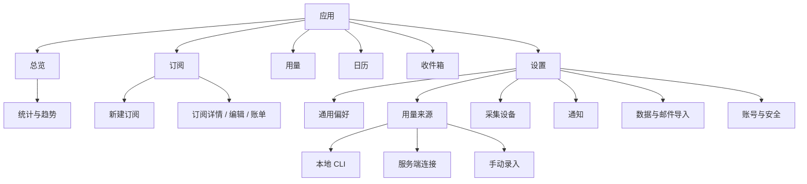
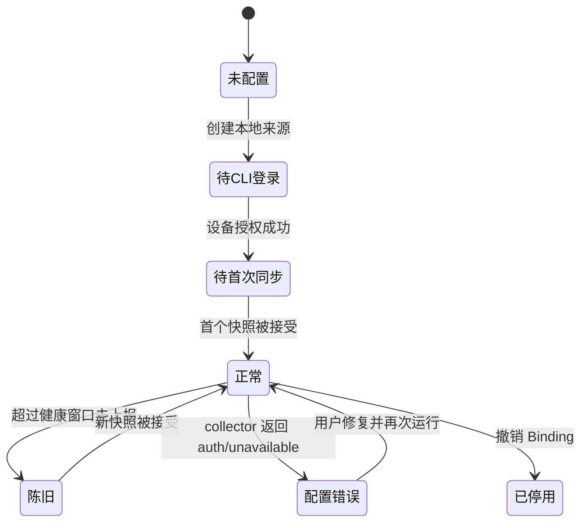

# conspectus 全站前端与功能设计

> 状态：实施基线
> 版本：1.0
> 更新：2026-08-10
> 范围：全部用户可见页面、响应式应用壳层、用量来源配置与 CLI 采集闭环

## 1. 目标

conspectus 的首页应在十秒内回答四个问题：我订阅了什么、花了多少、何时续费、用量是否健康。其他页面围绕这四个问题展开，不让用户理解 Binding、Snapshot、authority 等内部模型。

本轮重做的验收目标：

1. 桌面端从“每页一张 720px 居中卡片”升级为稳定侧栏、宽内容区和明确页面标题的资产工作台；移动端保留五个高频入口，并将次级功能收进“设置”。
2. 页面使用同一套标题、卡片、状态、表格、表单、空状态、错误和加载规范。
3. 本地采集从“先手动建额度，再自由填写 metric，再绑定”改为“选订阅 → 选采集器 → 选指标 → 配置 CLI → 验证首次同步”。
4. 手动、CLI、服务端 Provider 三类来源边界清晰；一张额度只有一个权威来源，切换必须由用户显式确认。
5. 原有订阅、账单、通知、导入、认证和数据安全语义保持不变。

## 2. 现状问题

### 2.1 全局体验

- 所有业务页复用营销页式 `.shell`，桌面空间利用率低，长表格和复杂设置被挤在窄卡片里。
- 桌面导航位于顶部、移动导航位于底部，但没有页面上下文、账号入口和设置子导航。
- 页面标题、主要操作、说明文字的相对位置不稳定；有的先操作、有的先空状态、有的把操作藏在 `details`。
- 颜色角色过少，错误、警告、品牌强调共用砖红色，用户难以判断风险级别。
- 表格在移动端只能横向滚动，没有优先级降级；设置页的信息密度尤其高。

### 2.2 CLI 采集断点

当前流程要求用户先创建一张手动额度。创建时系统同时建立 manual Binding 并把它设为权威来源；随后添加 local Binding 不会抢占权威。因此 CLI 即使成功上报，`/usage` 的当前读数也可能仍显示手动值。

此外：

- 指标是自由文本，只校验前缀，容易配置出 collector 永远不会产出的指标。
- 采集器变化后指标输入提示不会随之变化。
- 用户看不到“已绑定但未首次上报”“上次成功时间”“当前权威来源”。
- 设备管理、绑定管理和 CLI 安装说明分散在三个页面。
- MiniMax 属于服务端 Provider，不应出现在 CLI 采集器；Provider 表单也不应一律使用“余额/币种”措辞。

## 3. 信息架构

### 3.1 主导航

| 入口 | 路由 | 用户任务 |
| --- | --- | --- |
| 总览 | `/` | 资产健康、花费、近期续费、浪费提示 |
| 订阅 | `/subscriptions` | 查找、创建和维护订阅 |
| 用量 | `/usage` | 查看额度、预测和来源状态 |
| 日历 | `/calendar` | 按日期查看将付金额与试用结束 |
| 收件箱 | `/inbox` | 处理邮件解析草稿 |
| 设置 | `/settings` | 来源、设备、通知、数据、账号 |

`/analytics` 从总览进入；`/me` 从侧栏底部账号卡进入。旧 `/devices`、`/notifications` 继续重定向，保证书签兼容。

## 4. 应用壳层

### 4.1 桌面（≥ 960px）

- 侧栏宽 248px，固定在左侧；上方为品牌，下方为账号与设置入口。
- 主内容最大宽度 1240px，左右留白 32–48px，不再用外层大卡片包住整页。
- 页面头由 eyebrow、H1、摘要和右侧主操作组成；正文按 section 分区。
- 侧栏当前项使用浅色底、左侧/图标强调和 `aria-current="page"`，不只依赖颜色。

### 4.2 平板（720–959px）

- 侧栏收窄为 80px，仅保留图标；通过可访问名称和 tooltip 表达标签。
- 内容区保持 24px 留白，表格按需横向滚动。

### 4.3 手机（< 720px）

- 顶部显示品牌与设置入口，底部固定五个高频入口：总览、订阅、用量、日历、收件箱。
- 页面左右留白 16px，主按钮在关键表单中可铺满。
- 数据表优先隐藏低优先级说明；不能无损压缩时才允许容器内横向滚动。
- 兼容安全区 `env(safe-area-inset-*)`。

## 5. 视觉系统

### 5.1 色彩角色

| Token | 明色 | 暗色 | 用途 |
| --- | --- | --- | --- |
| ink | `#171A22` | `#F4F3F0` | 主文字、品牌骨架 |
| accent | `#C4553C` | `#E07A5F` | 主操作、当前项、品牌 |
| canvas | `#F5F2EC` | `#111319` | 页面背景 |
| surface | `#FFFDF9` | `#191C24` | 卡片与输入框 |
| muted | `#6D706F` | `#A7AAA7` | 次要信息 |
| border | 派生 | 派生 | 分隔和轮廓 |
| success | `#237A57` | `#67C89A` | 正常、已验证、在线 |
| warning | `#9A6700` | `#E8B949` | 待处理、即将到期 |
| danger | `#B42318` | `#FF8A80` | 失败、撤销、删除 |

状态不能只靠颜色；必须同时有文字或图标。图表继续使用品牌色与 ink/muted 派生色，保证产品识别。

### 5.2 排版与间距

- 字体栈：Inter / 系统无衬线；数字启用 tabular nums。
- H1 36–48px，页面 H2 22px，正文 15–16px，辅助信息 13px。
- 4px 基础网格；常用间距 8/12/16/24/32/48。
- 卡片圆角 18px，输入框 12px，按钮 12px，胶囊状态 999px。
- 阴影只用于浮层和重点卡片；普通分区主要靠 surface 与 border 建立层级。

### 5.3 组件

- `PageHeader`：路径语境、标题、说明、主操作。
- `MetricCard`：标签、主值、补充信息、趋势/警告。
- `SectionCard`：标题、说明、内容和可选操作。
- `StatusBadge`：success/warning/danger/neutral/trial。
- `DataTable`：表头、数字对齐、行 hover、空行和窄屏容器。
- `FormField`：标签、必填标识、提示、字段错误；错误与控件通过 id 关联。
- `EmptyState`：一句状态、一句下一步、最多一个主操作。
- `InlineNotice`：info/warning/danger/success 四级反馈。
- `Skeleton`：尽量匹配目标页面结构，尊重 reduced motion。

## 6. 页面设计

### 6.1 总览 `/`

首屏结构：欢迎/日期语境 → 本月净支出、未来 30 天、年化成本、额度风险四张卡 → 近期续费 → 需要关注 → 活跃订阅。

- 金额缺投影时在卡片内给出“数据不完整”，禁止默认为 0。
- “可能浪费”属于建议，不使用危险态；提供官网取消或订阅详情入口。
- 无订阅时只显示 onboarding 空状态：创建订阅 → 配置用量来源 → 开启提醒。
- 统计入口放在花费区标题右侧，不再作为孤立的一行链接。

### 6.2 统计 `/analytics`

- 顶部显示统计口径、本位币和缺失投影提示。
- 趋势图与分类环图分别放入 SectionCard；图例在移动端换行。
- 缺数据时解释需要“启用中的订阅/账单记录”，并给创建入口。

### 6.3 订阅列表 `/subscriptions`

- 页面头主操作为“新建订阅”。
- 默认 active/trial 在前，再按续费日排序；保留状态、周期、金额和下次续费。
- 桌面表格整行可进入详情；手机按订阅卡显示核心字段。
- 后续筛选位保留：状态、分类、币种和关键字，但本轮不引入伪搜索。

### 6.4 新建订阅 `/subscriptions/new`

- 表单分为基础信息、计费、生命周期、归类和备注。
- 试用状态显示 trialEndsAt；custom 显示 cycleDays；autoRenew=false 解释不会生成后续账单。
- 主操作“创建订阅”，次操作“取消返回”；成功后进入详情。

### 6.5 订阅详情 `/subscriptions/[id]`

- 顶部显示状态、价格/周期、下次续费和自动续费；操作聚合在标题区。
- 正文顺序：基本信息 → 账单记录 → 退款/调账 → 编辑 → 危险操作。
- 删除、取消等操作必须说明影响范围并确认。

### 6.6 用量 `/usage`

- 顶部摘要：健康额度、接近上限、待首次同步、来源异常。
- 每张额度卡显示订阅、友好指标名、已用/上限、周期结束、预测、权威来源和最近采集时间。
- `local_agent` 显示“本地 CLI”，`provider` 显示 Provider 名称，`manual` 显示“手动”。
- 无用量时主操作进入“设置 / 用量来源”，不再只引导手动录入。
- Provider 连接状态作为“来源健康”次级区，不与额度卡混为一层。

### 6.7 日历 `/calendar`

- 月切换保留当前月份语境和回到本月操作。
- 同一天多币种不强行相加；分别显示小计。
- 手机使用按日议程列表，桌面使用七列月历；今天与有账单日期都需有非颜色提示。

### 6.8 收件箱 `/inbox`

- 顶部解释“接受后才入账”，并显示待处理数量。
- 草稿卡优先显示商户、金额、日期、置信度和匹配订阅；证据细节折叠。
- 低置信度先编辑再接受；过期草稿禁止接受并解释原因。
- 空状态直接进入邮件导入设置。

### 6.9 设置首页 `/settings`

- 通用设置（时区、本位币）位于正文；其余分区用带状态摘要的入口卡。
- 本位币 rebase 显示进度、旧口径仍生效的说明和失败重试。
- 分区命名统一为：用量来源、服务端连接、采集设备、通知、数据与导入、账号与安全。

### 6.10 用量来源 `/settings/usage`

页面按任务而非数据表组织：

1. “添加本地采集”卡：选择订阅、采集器和它真实支持的指标，一次创建额度与 Binding。
2. “已配置来源”：每张额度显示全部 Binding、权威标记、最近读数；可显式切换权威来源或删除整项指标。删除指标级联删除 Binding、Snapshot 与周期汇总，但不影响订阅和其他指标，必须二次确认。
3. “手动额度”：作为不装 CLI/无 API 的兜底，在独立折叠区创建和更新。
4. “运行 CLI”：固定展示安装、configure、login、run 四步，并链接采集设备。

支持的本地模板：

| Collector | 运行环境 | 指标 | 模型 / 单位 |
| --- | --- | --- | --- |
| Codex | Codex 桌面版或 CLI 已登录 | 5 小时、每周、生命周期 tokens | quota/%、quota/%、counter/tok |
| Claude Code | 额度与桌面版共享；Windows 需 `claude setup-token` + `CLAUDE_CODE_OAUTH_TOKEN`，仅启动或登录桌面端不够 | 5 小时、7 天 | quota/% |
| Kimi Code | 复用 `~/.kimi-code` OAuth 凭据；collector 按官方流程自动刷新，无需保持应用运行或再次登录 | 5 小时、每周 | quota/req |

产品进程是否运行不作为采集条件。collector 读取的是本机产品凭据或受支持的本地接口；页面必须把“Conspectus CLI 设备授权”和“产品账号凭据”作为两个独立状态展示，不能把前者成功等同于产品已可采集。

配置状态机：

权威来源规则：

- 新建的本地模板额度直接以 local Binding 为权威，不经过 manual Binding。
- 已有额度新增来源时不得静默抢占；界面提示并要求确认“改用此来源”。
- 切换事务从目标 Binding 最新 Snapshot 重建当前值；若还没有快照，保留旧值但标记陈旧，直到首次同步。
- 非权威来源的快照仍保留用于审计，但不能覆盖当前显示值。

### 6.11 服务端连接 `/settings/connections`

- 明确说明它运行在服务器，不需要 CLI；MiniMax 等无本机凭据的服务商归此处。
- Provider 选择后展示对应字段和说明；通用文案使用“归属订阅/计量单位”，余额型 Provider 才显示“余额币种”。
- 列表显示状态、最近/下次同步和可执行修复建议；停用说明 Binding 回退规则。

### 6.12 采集设备 `/settings/devices`

- 顶部显示安装与登录步骤，列表显示设备名、平台、版本、上报时间和状态。
- “待首次上报”不是错误；超过三天才标记离线。
- 撤销只撤销单设备公钥，不撤销共享 Binding；全部 CLI 失效需在 certus 撤销应用授权。

### 6.13 通知 `/settings/notifications`

- 分为投递渠道和提醒规则两个 SectionCard。
- 邮箱未验证时在渠道区显示阻断原因和修复路径；不承诺补发历史提醒。
- 规则配置以可读摘要呈现，不直接把 JSON 作为主要文案。
- Webhook 密钥轮换和渠道停用均需明确即时影响。

### 6.14 数据 `/settings/data`

- 分为导出、CSV 导入、邮件导入和隐私保留四区。
- 导出重新认证属于安全步骤；用户返回后应保留已选实体。
- 邮件原文保留开关与立即清除属于隐私控制；清除是不可恢复操作。

### 6.15 我的 `/me`

- 账号摘要显示认证方式、邮箱验证、时区、本位币、注册与最近登录。
- 退出登录是普通次操作；永久删除独立危险区，需重新认证和邮箱二次确认。
- 明确删除 conspectus 数据不会删除 certus 账号。

### 6.16 登录 `/login`

- 公共页使用分栏认证壳：左侧品牌价值，右侧登录操作；窄屏合并为单列。
- 同时启用 local/certus 时使用清晰分隔；SSO 为推荐主操作，本地账号为备用。
- 注册成功、重置成功和错误使用不同 notice 语义。

### 6.17 注册 `/register`

- 仅 local auth 开启时存在；说明 12 位密码和验证邮件。
- 不泄漏邮箱是否存在以外的额外账号信息；已有邮箱使用统一错误文案。

### 6.18 重置密码 `/reset-password`

- 请求阶段不暴露邮箱是否注册；设置阶段显示 token 无效/过期后的重新申请入口。
- 成功重置会使全部会话失效，提交前可见。

### 6.19 认证错误 `/auth/error`

- 根据 login/bind/reauth 分支返回正确上下文，不统一跳首页。
- 显示用户可执行的下一步；内部异常细节不暴露。

### 6.20 全局加载与错误

- 加载骨架模拟页面头、指标卡和数据列表。
- 错误页支持原地重试、返回总览；digest 仅用于反馈定位。
- 404 使用公共品牌壳和明确的总览、订阅返回入口，不暴露记录是否属于其他租户。

## 7. 关键数据与动作契约

### 7.1 添加本地来源

输入：`subscriptionId`、`collectorId`、`metrics[]`。`metrics` 必须来自服务端目录，不接受自由文本。

服务端对每个指标原子执行：

1. 校验订阅属于当前用户。
2. 按 `(subscriptionId, metric)` upsert UsageQuota；新 quota 使用模板的 kind/unit/resetCycle 和合法初值。
3. upsert `(quotaId, local_agent, metric)` Binding 并记录 collectorId。
4. 新 quota 将 local Binding 设为权威；旧 quota 保留原权威，返回 `authorityNeedsConfirmation`。
5. revalidate `/settings/usage`、`/usage` 和 manifest。

### 7.2 切换权威来源

输入：`quotaId`、`bindingId`。服务端必须重新检查 tenant、Binding 归属与 active 状态，并使用数据库锁/CAS 保证并发安全。

### 7.3 状态显示

- 最近 Snapshot ≤ collector 预期周期：正常。
- 有 active local Binding、无 Snapshot：待首次同步。
- 最近 Snapshot 超过健康窗口：陈旧。
- `lastSyncStatus=failed`：配置错误，并展示安全处理后的错误摘要。
- 被撤销 Binding 只在审计信息中显示，不提供设为权威操作。

## 8. 可访问性与交互

- 正文和控件对比度满足 WCAG AA；焦点环始终可见。
- 所有图标按钮都有可访问名称；当前导航使用 `aria-current`。
- 进度条提供 `role=progressbar`、数值范围和文本说明。
- 表单错误与字段关联；提交中禁用重复提交并保留按钮宽度。
- 动画只用于 150–220ms 状态过渡；`prefers-reduced-motion` 下关闭。
- 点击目标至少 44×44px；移动端固定导航不遮挡内容。

## 9. 安全与隐私

- Provider 密钥只提交、不回显；浏览器不保存 ID Token、access token 或 OIDC profile。
- CLI 页面只展示命令和设备状态，不展示设备令牌、签名私钥或 certus 授权码。
- 所有 Server Action 先校验 Session，再做 Zod 校验和租户约束；客户端传入的 Binding/Quota id 不能被信任。
- 外链取消地址使用 `rel="noreferrer"`；危险操作需要作用范围说明和确认。
- 原始邮件、Webhook 密钥和导出重新认证继续遵循既有安全策略。

## 10. 实施与验收

实施顺序：设计令牌 → 应用壳层 → 公共页面 → 业务页面 → 设置页面 → 本地来源闭环 → 回归与浏览器验收。

验收矩阵：

| 类别 | 验收 |
| --- | --- |
| 功能 | 所有原有 Server Action 可达；新增本地来源可出现在 manifest；切换权威后下一次采集更新当前值 |
| 页面 | 19 个页面均使用新壳层/组件语义；无横向页面级溢出 |
| 响应式 | 390px、768px、1440px 三档；底栏和侧栏状态正确 |
| 可访问性 | 键盘可遍历；焦点可见；状态非纯颜色；表单标签完整 |
| 性能 | Server Component 保持默认；不为纯展示引入客户端状态；图表按现有边界加载 |
| 安全 | 密钥不回显；action 租户校验；危险操作确认；外链属性正确 |
| 质量 | `npm test`、`npm run build` 通过；登录态下完成桌面/移动关键路径浏览器验收 |
